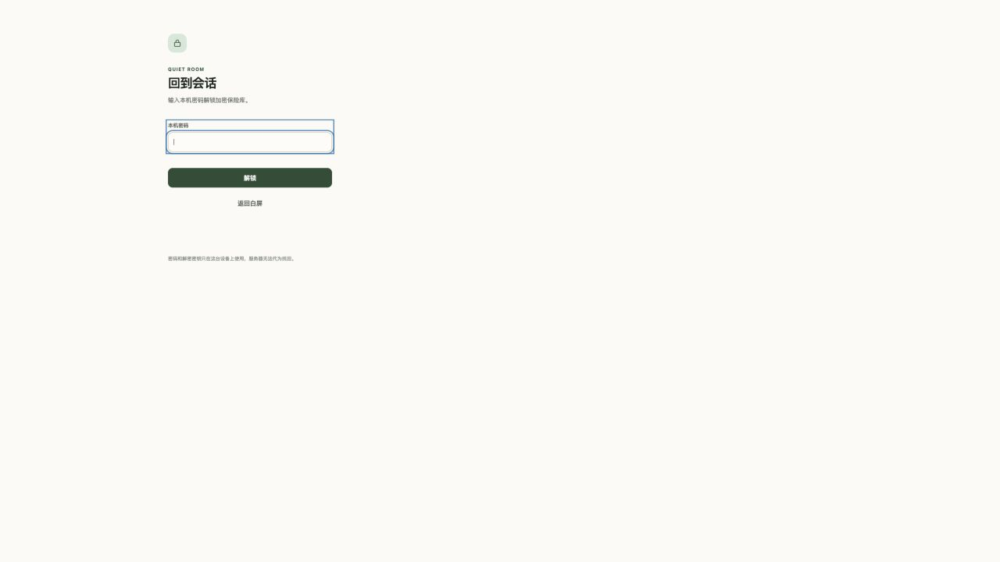
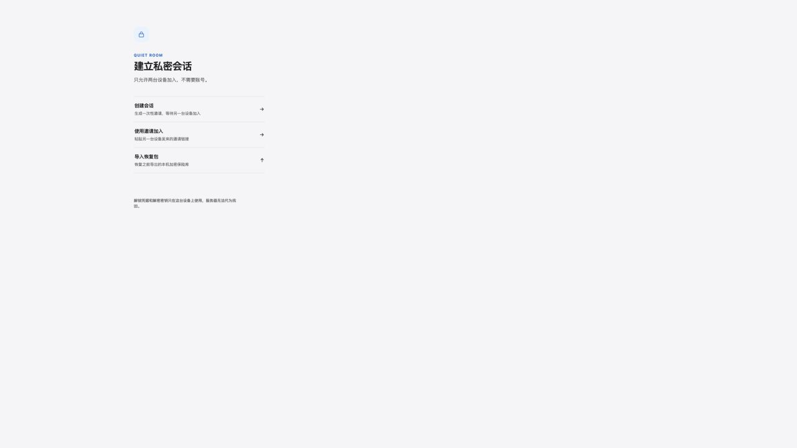
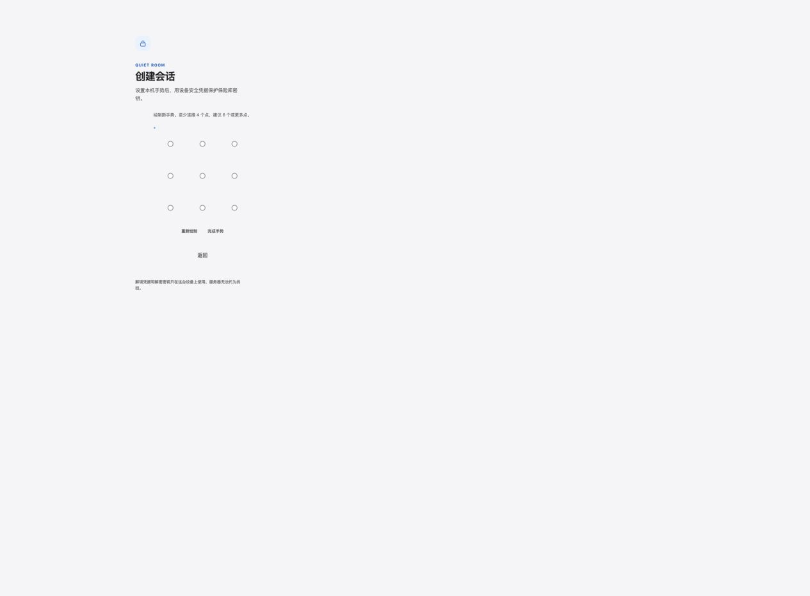
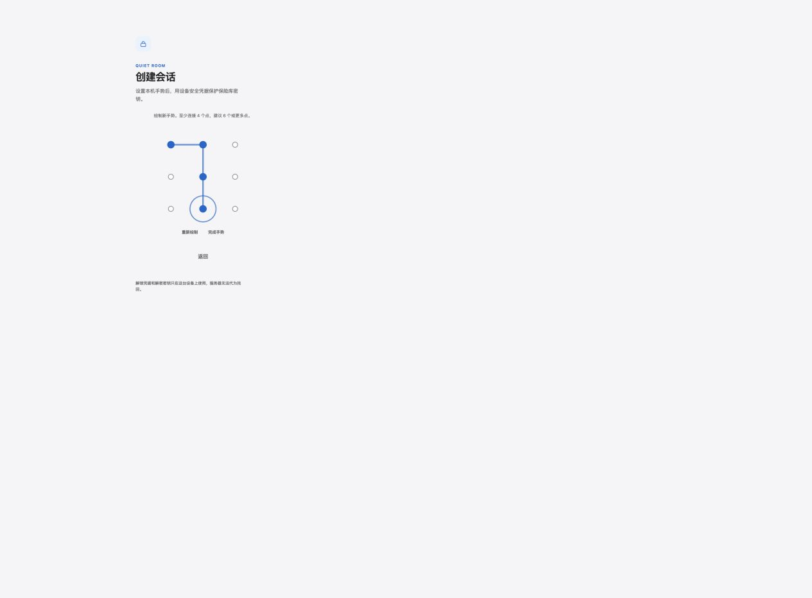
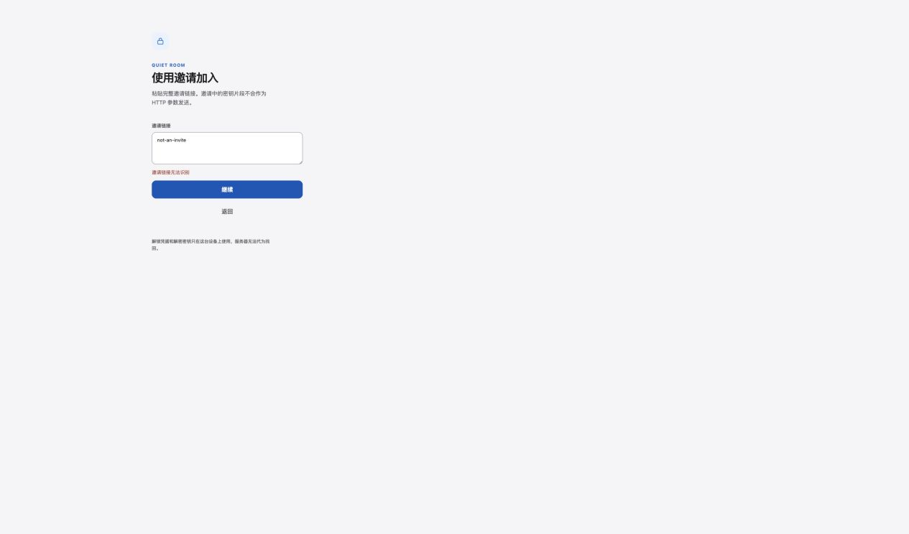

# Quiet Room 项目审计报告

审计日期：2026-09-03
范围：客户端、服务端、存储、PWA、推送、部署、CI、产品流程、可访问性与上线安全门槛。
方式：静态代码审阅、当前代码构建与自动化测试、依赖漏洞检查、Codex 应用内浏览器实测及截图。

## 结论

项目已经具备相当扎实的安全意识和工程基础：浏览器侧加密、MLS 状态与本地消息记录的原子提交、文本渲染默认使用安全 DOM API、恢复码、离线/重连设计、限流和备份文档都不是“样子工程”。本轮已完成代码、配置、文档和回归测试修复；当前构建、单元/集成测试、真实 Chrome 双端流程和生产依赖审计均通过。

本轮已关闭推送盲 SSRF、WebSocket 队列永久失效、MLS 未就绪图片上传、旧 Service Worker、长历史/消息配额扫描、图库预加载、损坏保险库空白死路、WebAuthn RP 诊断、幂等冲突、代理限流信任、孤儿房间、恢复序号和主要无障碍缺口。仍不能把本地代码验证等同于高安全公开放行：独立密码学/应用安全审计、可信客户端发布链、设备替换吊销与 MLS epoch、真实设备矩阵、异地不可变备份与告警、Android/iOS 推送验收仍是外部上线门槛。

建议发布判断：可继续内部受控测试；公开高安全发布必须由责任人逐项关闭 `PRODUCTION_SECURITY_GATE.md`，并保留本报告中的残余风险说明。

## 验证结果

- `npm run check`：通过。Vite 构建成功；Vitest 共 12 个测试文件、29 个测试全部通过。
- `npm run test:browser`：通过。真实 Chrome 覆盖虚拟 CTAP2.1/PRF 双端建房、可同步凭据、取消后重试、消息/回执、隐私帘、图库按需原图、续传、恢复和旧库迁移。
- `npm audit --omit=dev`：当前返回 0 个已知漏洞。这个结果只覆盖 npm 公告库中的已知依赖问题，不等价于密码学实现或业务安全审计。
- 构建告警：`@hpke/common` 引入 Node `crypto` 时被 Vite 标记为浏览器外部模块；基础首屏可加载，但应在 CI 中验证所有实际使用的 MLS/HPKE 分支不会落到浏览器外部占位模块。
- 浏览器实测：覆盖隐私帘、首次使用入口、创建会话手势、键盘选择手势、邀请错误态，以及真实 Chrome 中的双端配对、消息、图库、恢复和迁移流程；推送供应商和真机系统仍需按上线门槛验收。
- 仓库现有 `PRODUCTION_SECURITY_GATE.md` 中的 9 项上线门槛仍有效，不能被本轮自动化测试替代。

## P0：公开上线前必须处理（代码项已修复，外部门槛仍阻塞）

### 1. 推送订阅端点可被认证用户用作盲 SSRF（已修复）

位置：`server/push.mjs:23-30`、`server/push.mjs:45-59`。

原问题是服务端只验证 endpoint 是 HTTPS、长度和密钥格式，然后直接交给 `webpush.sendNotification`。这会允许认证用户把订阅 endpoint 指向任意 HTTPS 地址。

当前实现已维护默认供应商主机允许列表，支持显式 `PUSH_ALLOWED_HOSTS` 覆盖；唤醒前再次检查 HTTPS、主机、IP 字面量和 DNS 全部解析结果，并拒绝 loopback、RFC1918、link-local、ULA、保留、组播和元数据网段。订阅注册也复用主机规则，服务端测试覆盖私网/恶意主机。生产仍应配置出站防火墙或代理来消除 DNS 重绑定竞态。

建议：

- 只允许经过验证的 Web Push 服务主机；若需要兼容多个供应商，维护明确的允许规则并记录更新流程。
- 在 DNS 解析后拒绝 loopback、RFC1918、link-local、ULA、multicast、保留网段和云元数据地址；重定向后重新校验。
- 用受控出站代理或防火墙限制推送进程的网络目标。
- 增加 IP 字面量、私网域名、DNS 重绑定和重定向测试。OWASP 的 SSRF 防护建议同样强调允许列表和私有地址校验：<https://cheatsheetseries.owasp.org/cheatsheets/Server_Side_Request_Forgery_Prevention_Cheat_Sheet.html>。

### 2. 现有生产安全门槛仍未关闭

位置：`PRODUCTION_SECURITY_GATE.md`。

尤其关键的是：

- MLS/密钥绑定/状态提交/Welcome/重放处理的独立密码学审计。
- 独立应用安全审计。
- 可签名、可复现或由独立可信渠道交付的客户端；否则恶意或被入侵的服务端可以替换浏览器 JavaScript。
- 设备替换时对旧设备进行认证吊销并推进 MLS epoch。
- WebAuthn PRF 的真实浏览器、操作系统和设备矩阵。
- 异地不可变备份、恢复演练、告警、SLO、WAF/DDoS、漏洞响应、密钥轮换和 on-call。

另外，当前使用的 `ts-mls` 项目自身明确提示没有经过正式安全审计，不应把“采用 RFC 9420”直接等同于“生产密码学实现已审计”：<https://github.com/LukaJCB/ts-mls#%EF%B8%8F-security-disclaimer>。

## P1：建议一轮迭代内修复（已完成代码修复）

### 3. 一次成员处理异常会永久毒化 WebSocket 队列（已修复）

位置：`src/lib/api.ts:229-235`。

`membershipBarrier = membershipBarrier.then(operation)` 没有在链上恢复 rejection。只要一次成员变更处理失败，后续所有依赖该 barrier 的成员事件、消息和同步任务都会从已拒绝的 Promise 继续失败，表现为“连接还在，但会话不再前进”。

建议把异常记录与队列恢复分开，确保后续操作能继续；同时增加“某次 handler 主动抛错，下一次成员更新和消息仍能处理”的回归测试。对安全协议状态异常仍应 fail closed，但不能用一个永久 rejected 的 Promise 隐式实现。

修复：成员队列现在在成功和失败分支都会继续执行下一项，异常通过独立错误回调上报；回归测试覆盖一次失败后的成员事件和消息继续处理。

### 4. MLS 未就绪时图片入口仍可用，会先上传再发送失败（已修复）

位置：`src/app.ts:1191`、`src/app.ts:1246-1249`、`src/app.ts:1815-1849`。

文本输入和发送按钮会根据 `cryptoReady` 禁用，但图片 input 没有。用户若在 MLS 尚未激活时选图，客户端会完成加密和分片上传，之后发送 MLS 应用消息失败；发送函数又在内部吞掉异常，图片流程可能误以为只是暂未入 outbox，留下已上传的孤儿密文和模糊的恢复状态。

建议同时处理 UI 和业务层：禁用图片入口；上传前强制检查 MLS readiness；让发送函数把明确失败返回调用者；失败时清理或登记可恢复的 upload plan；服务端为孤儿上传增加 TTL 清理。

修复：图片选择器和业务上传路径都检查 MLS active 状态；发送错误返回调用方；未完成上传与未认领单成员房间由服务端 TTL 清理，且创建失败会回收未持久化房间。

### 5. Service Worker 缓存策略可长期提供旧客户端（已修复）

位置：`public/sw.js:1`、`public/sw.js:35-42`。

当前 cache 名称固定为 `quiet-room-shell-v2`，对多数同源 GET 使用 cache-first，并会缓存开发环境中未带 hash 的 `/src/*.ts`、manifest 和图标。实测同一 localhost 源在当前代码已经切换到“手势 + 设备凭据”后，仍显示旧的“本机密码解锁”客户端。对安全应用，这不仅是开发困扰，也会让安全修复无法可靠到达用户。

建议：

- 开发环境不注册 Service Worker，并主动清理旧开发 SW/cache。
- 生产只预缓存构建生成的带内容 hash 资产；非 hash 资源使用 network-first 或明确版本。
- 每次发布生成新的缓存版本和 manifest，不复用旧 key。
- 增加版本探测、提示刷新和不可兼容版本的强制升级机制。
- 在 CI 或发布验收中加入“旧版本安装 → 发布新版本 → 刷新后确认代码版本更新”的测试。

修复：开发环境不注册并主动清理 Service Worker；生产缓存版本已升级，只有带 hash 的构建资源及静态图标/manifest 可进入缓存，导航请求使用 network-first。浏览器回归已覆盖当前构建。

### 6. 消息历史和图库在目标上限下不可扩展（已缓解）

位置：`src/app.ts:1602-1626`、`src/lib/vault.ts:655-673`、`server/storage.mjs:163-164`、`server/storage.mjs:398-402`。

客户端每次更新都会复制、排序并重建全部消息 DOM；启动时顺序解密所有本地历史。服务端每插入一条消息都对整个房间执行 `COUNT(*)` 与 `SUM(LENGTH(envelope))`。当房间接近 100,000 条消息时，客户端延迟、DOM 数量、解密耗时和数据库扫描成本都会持续增加；累计写入可能呈近似 O(n²) 的历史扫描成本。

建议：服务端维护事务内计数器或聚合表；同步和本地存储都使用游标分页；UI 增量追加并虚拟化列表；启动时只解密最近一页，向上滚动再加载；为 1k/10k/100k 历史建立性能基线和门槛。

修复/缓解：房间维护消息计数与字节计数；IndexedDB 使用 `(roomId, seq)` 游标分页；启动只解密最近 200 条，向上滚动加载更早历史；消息 DOM 复用未变化节点。仍需在目标手机上补 1k/10k/100k 基准和虚拟化评估。

### 7. 大图解密与图库缓存有移动端内存崩溃风险（已缓解，仍有单文件峰值）

位置：`src/lib/file-crypto.ts:147-174`、`src/app.ts:1759-1776`、`src/app.ts:1815-1849`。

解密函数把所有明文分块先保存在数组中，最后再构造 Blob；单文件上限 256 MiB。图库可为多个可见图片同时下载、解密和缓存完整原图及 object URL，峰值内存会远高于文件大小，移动浏览器很容易被系统回收。

建议：发送时额外生成小尺寸加密缩略图；图库只解密缩略图；点开或下载时才处理原图；限制并发；用 LRU 释放 Blob URL；在支持的平台评估流式写入；按真实设备内存重新确定上传上限。

修复/缓解：图库网格只显示清单元数据，用户点开详情时才下载并解密原图；客户端增加 96 MiB LRU Blob 缓存并在锁定时撤销 URL。单文件解密仍需一次性构造完整 Blob，必须通过真机内存基准决定最终上限或后续引入缩略图/流式实现。

### 8. 损坏的本地保险库可能造成空白死路（已修复）

位置：`src/app.ts:259-282`、`src/lib/vault.ts:289-295`。

`hasStoredVault()` 只判断是否存在任意存储值，因此会进入解锁页；随后 `readStoredVault()` 若因结构损坏返回 null，渲染函数直接退出。用户得到空白/无操作界面，也看不到导入恢复码或安全清理入口。

建议新增独立的“本地数据损坏”状态：解释发生了什么；允许导入恢复码；提供诊断导出；只有在二次确认后才清除本地数据。为截断 JSON、旧 schema、字段缺失、密文损坏各写一条测试。

修复：保险库存在性与结构校验分离；损坏记录进入可操作恢复页，支持恢复包导入、元数据诊断下载和二次确认清除；修复了 falsy 损坏记录被误判为首次运行的边界。

### 9. WebAuthn RP ID 依赖当前 hostname，域名迁移会锁死设备（已缓解）

位置：`src/lib/platform-vault.ts:65`、`src/lib/platform-vault.ts:98`。

注册与解锁都使用 `location.hostname` 作为 RP ID，但本地记录没有把注册时 RP ID 作为可诊断字段保存。WebAuthn 凭据受 RP ID 作用域约束；换域名、从子域迁移或错误的反向代理域名都可能使设备凭据不可再用。规范依据：<https://www.w3.org/TR/webauthn-3/>。

建议把注册 RP ID、origin 和版本写入本地元数据；不匹配时展示明确错误而非通用解锁失败；把域名所有权和迁移列为密钥材料级别的运维依赖；迁移前强制提醒用户导出恢复材料。

修复/缓解：新注册记录保存 `rpId` 与 `origin`，解锁时在 WebAuthn 调用前检查 RP ID 是否匹配并给出域名绑定错误；域名迁移仍需提前导出恢复材料。

## P2：重要优化（代码项已完成或明确保留残余）

### 10. 可访问性状态表达不完整（已修复主要缺口）

位置：`index.html:14`、`src/lib/gesture.ts:58-85`、`src/lib/gesture.ts:170-183`、`src/app.ts:1688-1724`。

- 整个 `<main>` 被设置为 `aria-live="polite"`，而应用大量使用整页重渲染；屏幕阅读器可能重复播报整屏。应只保留独立的状态/通知 live region。
- 手势点支持键盘聚焦和选择，这是优点；但被选中的点没有 `aria-pressed` 或等价状态，也没有当前已选数量/撤销反馈，辅助技术无法理解图形变化。
- 恢复码弹窗有 `role=dialog` 与 `aria-modal`，但缺少焦点圈定、Escape 关闭、背景 inert 和关闭后的焦点恢复。

不要把这些问题描述成“整体符合 WCAG”；目前只能确认部分键盘与语义基础存在。

修复：移除整页 `aria-live`，为手势点增加 `aria-pressed` 与已选数量状态；恢复码弹窗增加描述、Escape 关闭、Tab 焦点圈定和关闭后的焦点恢复；邀请输入错误会设置 `aria-invalid` 并把焦点送回输入框。

### 11. MLS 消息载荷校验规则存在两套且强度不同（已修复）

位置：`src/lib/mls.ts:177-193`、`src/lib/crypto.ts:241-263`。

MLS 层的图片消息判断比通用 crypto 层更宽松，缺少 key/iv 的 base64 长度边界、原始文件大小上限、文件名/MIME/时间戳约束和严格 ID 规则。恶意但已加入的对端可以构造通过一层、在图库/下载路径失败的认证载荷。

建议使用一个共享 schema 作为唯一真相源，严格拒绝未知字段和越界数据，并针对边界值、超长字符串、畸形 base64、非法 MIME/UUID 做 property/fuzz 测试。

修复：`src/lib/message-payload.ts` 成为 crypto、MLS 和图片解密共用的严格校验入口，统一字段、长度、UUID、MIME、时间、文件大小与摘要规则；边界回归仍可继续扩展为 fuzz/property 测试。

### 12. 服务端幂等键冲突没有验证密文是否一致（已修复）

位置：`server/storage.mjs:384-397`。

重复 `clientMsgId` 只验证发送者相同，没有验证已保存 envelope 与重试 envelope 完全一致。客户端同步阶段可能发现冲突并进入 fatal，但服务端应更早返回明确的 `MESSAGE_CONFLICT`，避免把协议一致性依赖给客户端补救。

修复：同一客户端消息 ID 重试时现在对规范化完整 envelope（含密文）做比较，发送者或内容不一致都会返回 `MESSAGE_CONFLICT`。

### 13. 反向代理后应用层 IP 限流会退化成全局桶（已修复）

位置：`server/index.mjs:170`、`deploy/nginx-ai.shui.click.conf:1-54`。

应用用 `request.socket.remoteAddress` 作为键；部署在 Nginx 后时通常看到的都是代理地址。Nginx 自己有按客户端地址限流，因此不是完全无防护，但应用层“纵深防御”会变成所有用户共享一个桶，一名滥用者可能让其他用户被限流。

建议只在明确配置可信代理地址时解析转发头；或把核心限流改为 IP + room/device 组合。绝不能无条件信任客户端提供的 `X-Forwarded-For`。

修复：只有命中 `TRUSTED_PROXY_ADDRESSES` 的 socket 地址才会读取首个 `X-Forwarded-For`，否则继续使用直连地址；配置项和运维说明已补齐。

### 14. 创建会话先落服务端房间，再创建本地凭据（已修复）

位置：`src/app.ts:571-602`。

用户取消 WebAuthn 或创建凭据失败时，服务端房间已经创建，形成永久孤儿。建议增加未激活房间 TTL/GC，或采用两阶段激活；同时对失败给出清晰的重试/返回路径。

修复：创建流程在本地保险库尚未落盘时回收未封存房间；服务端增加未认领单成员房间 TTL 清理，持久化后的临时网络错误不再删除有效房间。

### 15. 恢复后持久序号的错误回退没有保留恢复基线（已修复）

位置：`src/app.ts:1065-1068`。

发生本地持久化异常时从 0 重新计算 durable sequence，忽略恢复保险库中的 `historyUnavailableBeforeSeq`。对从 checkpoint 恢复的设备可能回退到不正确的 last sequence。应以恢复基线作为下界，并加入“恢复后存储失败”的测试。

修复：错误回退以 `historyUnavailableBeforeSeq` 作为下界，避免恢复检查点的序号被错误降到 0。

### 16. PWA、文档与真实能力有偏差（已修复文档/CSS，真机素材仍是门槛）

位置：`public/manifest.webmanifest`、`TEST_PLAN.md`。

- manifest 只有 SVG 图标，缺少常用的 192/512 PNG、独立 maskable 资源及更完整的安装展示素材；需要在 Android/iOS 真机验证安装和推送，而不是只依赖桌面浏览器。
- 测试计划声称覆盖系统浅/深色，但 CSS 当前固定 `color-scheme: light`，属于文档漂移。要么实现暗色主题并测试，要么修正文档。

修复/保留门槛：已实现系统深色变量、reduced-motion 和高对比度样式，并同步产品/测试文档；PNG/maskable 图标及 Android/iOS 安装推送仍需真实设备验收，未用占位资产冒充完成。

### 17. CI、容器与发布链仍可加强（已加强，扫描/真机/告警仍是外部项）

位置：`.github/workflows/ci.yml`、`compose.yaml`、`scripts/deploy-production.sh`、`deploy/server/quiet-room-deploy`。

- CI 已有构建、单测和浏览器测试，但缺少依赖审计、SAST、secret scan、容器镜像扫描、SBOM/来源证明和发布产物可复现比较。
- 容器以非 root 用户运行是优点；还可增加只读根文件系统、`cap_drop`、`no-new-privileges`、PID/内存限制和健康失败策略。
- 发布脚本硬编码生产 IP/用户/密钥路径的默认值，拓扑耦合强，也不利于多环境复用。
- 服务器发布目录依赖手工清理，长期有磁盘耗尽风险；应按保留数量自动、可审计地清理，并对磁盘空间告警。

修复/加强：CI 新增生产依赖审计和 secret scan；Compose 增加只读根、tmpfs、capability drop、no-new-privileges、PID/内存限制；部署参数改为必填，成功切换后按保留数清理旧 Git worktree 与 predeploy 归档。容器扫描、SBOM、磁盘告警仍需接入生产平台。

### 18. 维护成本集中在超大文件

`src/app.ts` 约 2,043 行，`src/styles.css` 约 1,212 行，`src/lib/vault.ts` 约 846 行。当前功能继续增长后，状态转换、异常路径和渲染副作用会越来越难验证。

建议按应用状态机、会话控制器、恢复流程、图库、通知、视图组件拆分；把消息 schema、错误映射和安全常量集中；补充 ESLint/formatter、覆盖率门槛以及协议状态机的 property/fuzz 测试。拆分目标应是降低安全状态的隐式耦合，不是单纯追求小文件。

## 产品与界面审计

### Step 1：隐私帘

状态：设计目标成立，但存在天然的可发现性成本。

页面完全空白，长按后才进入应用，符合“旁观者看不出这里有应用”的产品意图。代价是正常用户也会判断页面损坏，且不可能依靠界面本身提供可访问提示。操作方式必须通过邀请渠道、帮助文档或受信任的带外说明交付。

### Step 2：缓存旧客户端

状态：原问题已修复；仍应在发布验收中保留版本升级测试。

审计时同一 localhost 源仍显示仓库旧版本的“输入本机密码解锁加密保险库”，这是旧 Service Worker cache-first 与固定 cache key 的直接用户证据。当前已升级缓存版本、限制缓存对象，并在开发环境主动注销/清理旧缓存。

### Step 3：首次使用入口

状态：健康。

“创建会话 / 使用邀请加入 / 导入恢复包”三条主路径层级清楚，副文案短，点击目标宽度充分，安全说明没有喧宾夺主。桌面端固定窄列留下大量空白，但与低刺激、移动优先定位一致；若未来承担桌面长会话，可单独优化桌面布局。

### Step 4：创建手势

状态：视觉清晰，辅助技术状态已补齐主要缺口。

九宫格、已连接路径、重置/完成/返回关系清楚，键盘可以聚焦和选择；当前 DOM 通过 `aria-pressed` 和独立状态文本暴露已选择数量。

### Step 5：无效邀请

状态：已补齐字段关联和错误后焦点。

错误紧邻输入框并使用 alert 语义，内容具体；输入框现在绑定 `aria-describedby`，提交失败设置 `aria-invalid` 并把焦点送回输入区域。

### 仍需外部验收的步骤

真实 Chrome 自动化已覆盖创建、双设备配对、消息收发、图片续传、图库、恢复与旧库迁移，并建立虚拟 WebAuthn 凭据；推送供应商、Android/安装态 iOS、VoiceOver/TalkBack、真机内存与设备替换仍不能由本地自动化替代。

## 做得好的地方

- 安全文档诚实地区分了内容机密性、元数据泄露、服务端替换客户端、终端失陷和恢复限制，没有把端到端加密描述成万能保证。
- 本地 MLS 状态与消息记录有事务化提交思路，避免“协议状态已推进但消息记录没落盘”的常见一致性问题。
- 文本和文件名等用户数据主要通过 `textContent`/属性设置渲染，审阅范围内未发现明显的动态 HTML 注入路径。
- 首次使用的信息架构简单，视觉层级安静一致，主要点击目标足够大，错误文案可理解。
- 服务端有消息/存储/房间限制，Nginx 也配置了基础限流；这为进一步加固提供了不错的起点。

## 建议执行顺序

1. 保持推送 SSRF 允许列表和出站防火墙配置，并为公开上线门槛指定责任人与证据。
2. 在目标手机上跑 1k/10k/100k 消息和多张大图基准，决定是否需要缩略图、流式解密或更低的单文件上限。
3. 补齐 Android/安装态 iOS 推送、VoiceOver/TalkBack、PWA 图标和设备替换流程的真实验收。
4. 接入容器扫描、SBOM、磁盘容量/备份告警和发布产物可复现比较。
5. 最后由独立方完成密码学和应用安全审计；只有这些证据都关闭后，才调整 `PRODUCTION_SECURITY_GATE.md` 的结论。

## 审计边界

本次不是渗透测试、密码学证明或第三方独立审计；没有攻击真实生产环境，没有创建新的真实推送订阅，也没有在多台手机上完成跨设备会话。本报告中的“未发现”只适用于已审阅代码和已执行测试范围。
