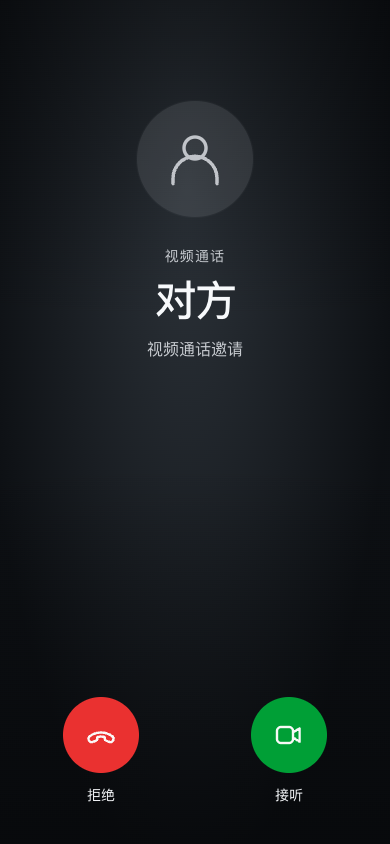
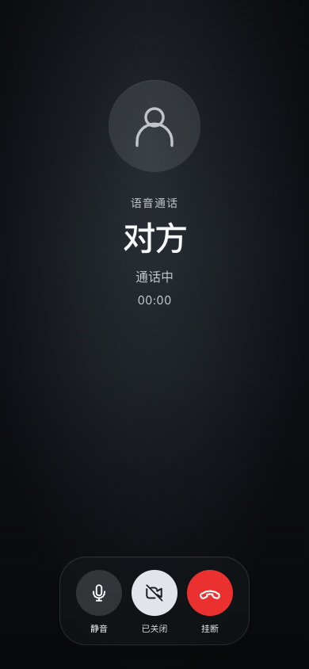
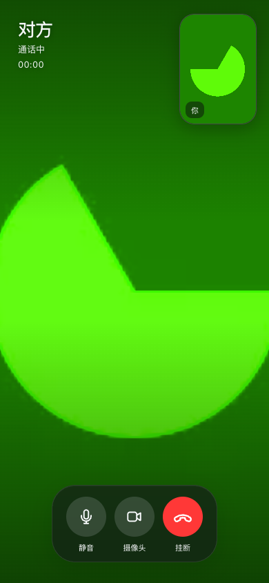
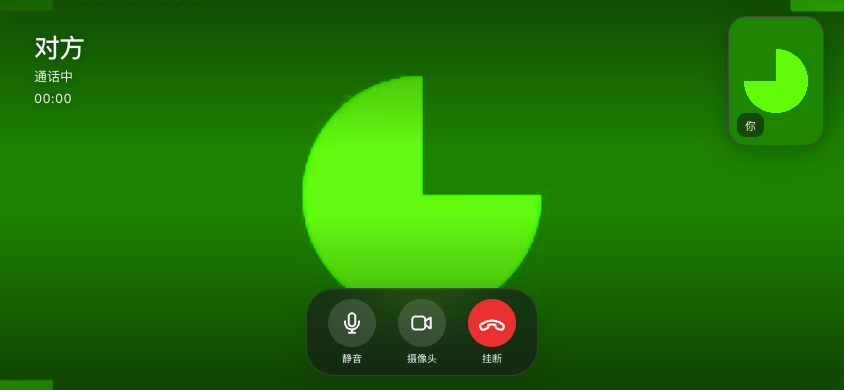

# 双人实时通话交付检查

2026-09-04，本地实现与回归完成。此记录不代表已发布至生产服务器。

## 已完成

- 真实 WebRTC 双向语音／视频通话，音频通话中可开启视频；接听、拒接、取消、静音、开关摄像头、可用设备上的摄像头切换与挂断。
- FaceTime 风格通话页：全屏远端画面、右上角本地预览、底部半透明控制区、绿色接听与红色结束。已检查手机竖屏、横屏与桌面布局。
- 基于本地 MLS 成员和设备本人签名声明的身份验证，以及加密、签名、短期有效和防重放的通话信令；服务器不录制或转码。
- 可选同主机 coturn 中继、临时凭据与长通话 ICE 更新；后续受控发布和回滚会保留已启用的通话配置。
- 锁定、后台、页面生命周期退出和设备撤销清理媒体；来电接听前不申请被叫采集，迟到的授权不会重新启动已结束的通话。

## 验证结果

| 验证 | 结果 |
|---|---|
| 生产构建与 TypeScript | 通过；现有密码库构建提示及约 512 kB 主包大小警告仍在 |
| 全部单元／服务器测试 | 33 个文件、205 项通过 |
| 通话专项单元／服务器测试 | 4 个文件、54 项通过 |
| 真实 Chrome 原生通话 | 双向媒体、语音转视频、摄像头关闭释放、双端 ICE 更新、反向全新视频呼叫、双端挂断均通过 |
| 通话界面回归 | 320px、横屏、桌面、焦点限制、Escape、稳定媒体节点、计时、镜像和销毁通过 |
| 真实应用浏览器回归 | MLS 配对、认证 WebSocket 上的通话，以及原有聊天、多设备、恢复流程最终全部通过 |
| 差异空白检查 | 通过 |

真实页面测试曾出现一次“已连接但远端视频轨道未在 15 秒内到达”的超时。加入双方媒体方向、轨道状态与编码／解码帧计数诊断后，完整页面回归和新增反向初始视频回归均通过，未稳定复现；未将其宣称为已定位的功能缺陷。若再次出现，测试将输出 `call-media-failure.json`，不会包含 SDP、候选 IP 或密钥。生产验收仍需确认实际网络中的音画稳定性。

## 页面截图

以下为实际页面截图。测试浏览器使用合成音视频，视频中的绿色图案是测试摄像头画面，不是真人或产品背景。

来电页：

语音通话：

视频通话：

横屏：

## 上线边界

本次没有访问或修改生产服务器。尚未填写服务器私有 TURN 配置、安装更新后的特权部署 helper 或开启云防火墙端口。本地没有 Docker，未运行真实 coturn 镜像。

上线前应按 `CALLS.md` 和 `DEPLOYMENT.md` 准备受控配置，在两部实际设备上验证 Wi-Fi／蜂窝网络互通、强制 TURN、30–60 分钟通话、网络切换及权限弹窗。网页前台通话不会变成原生系统来电；切后台会按现有隐私规则停止采集。加密保护传输内容，不能阻止对方录屏或已被攻陷的终端。
