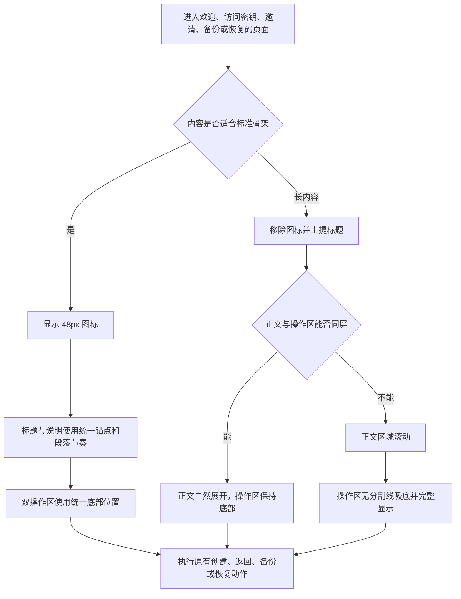

# 同类入口页版式流程

```mermaid
flowchart TD
    A[进入欢迎、访问密钥、邀请、备份或恢复码页面] --> B{内容是否适合标准骨架}
    B -->|是| C[显示 48px 图标]
    C --> D[标题与说明使用统一锚点和段落节奏]
    D --> E[双操作区使用统一底部位置]
    B -->|长内容| F[移除图标并上提标题]
    F --> G{正文与操作区能否同屏}
    G -->|能| H[正文自然展开，操作区保持底部]
    G -->|不能| I[正文区域滚动]
    I --> J[操作区无分割线吸底并完整显示]
    E --> K[执行原有创建、返回、备份或恢复动作]
    H --> K
    J --> K
```

版式切换只改变呈现和滚动归属，不改变认证、恢复、备份、隐私清理及页面返回行为。
