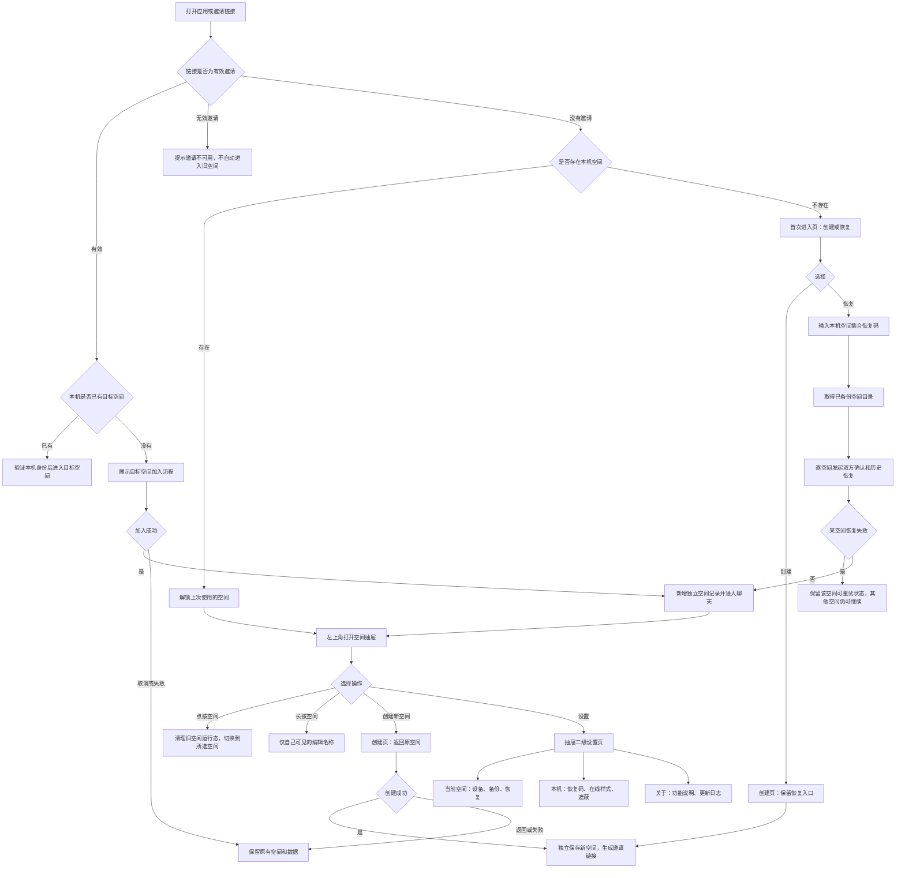
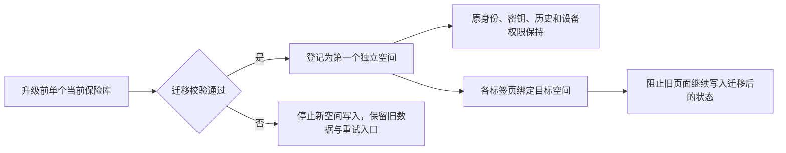

# 多空间业务流程（设计确认稿 S1）

下图描述目标行为。原型中的密钥、邀请、备份和双方确认仅为模拟；真实实现必须按 `SECURITY.md`、`RECOVERY_BACKUPS.md` 的现有安全边界验证。

```mermaid
flowchart TD
  A[打开应用或邀请链接] --> B{链接是否为有效邀请}
  B -- 有效 --> C{本机是否已有目标空间}
  C -- 已有 --> D[验证本机身份后进入目标空间]
  C -- 没有 --> E[展示目标空间加入流程]
  E --> F{加入成功}
  F -- 是 --> G[新增独立空间记录并进入聊天]
  F -- 取消或失败 --> H[保留原有空间和数据]
  B -- 无效邀请 --> I[提示邀请不可用，不自动进入旧空间]
  B -- 没有邀请 --> J{是否存在本机空间}
  J -- 存在 --> K[解锁上次使用的空间]
  J -- 不存在 --> L[首次进入页：创建或恢复]
  K --> M[左上角打开空间抽屉]
  G --> M
  M --> N{选择操作}
  N -- 点按空间 --> O[清理旧空间运行态，切换到所选空间]
  N -- 长按空间 --> P[仅自己可见的编辑名称]
  N -- 创建新空间 --> Q[创建页：返回原空间]
  Q --> R{创建成功}
  R -- 是 --> S[独立保存新空间，生成邀请链接]
  R -- 返回或失败 --> H
  N -- 设置 --> T[抽屉二级设置页]
  T --> U[当前空间：设备、备份、恢复]
  T --> V[本机：恢复码、在线样式、遮蔽]
  T --> W[关于：功能说明、更新日志]
  L --> X{选择}
  X -- 创建 --> Y[创建页：保留恢复入口]
  X -- 恢复 --> Z[输入本机空间集合恢复码]
  Y --> S
  Z --> AA[取得已备份空间目录]
  AA --> AB[逐空间发起双方确认和历史恢复]
  AB --> AC{某空间恢复失败}
  AC -- 是 --> AD[保留该空间可重试状态，其他空间仍可继续]
  AC -- 否 --> G
```

```mermaid
flowchart LR
  Old[升级前单个当前保险库] --> Check{迁移校验通过}
  Check -- 是 --> Index[登记为第一个独立空间]
  Index --> Keep[原身份、密钥、历史和设备权限保持]
  Check -- 否 --> Stop[停止新空间写入，保留旧数据与重试入口]
  Index --> Tabs[各标签页绑定目标空间]
  Tabs --> Fence[阻止旧页面继续写入迁移后的状态]
```

空间列表只在应用解锁后展示；设备验证不能由原型模拟的按钮替代。总恢复码的备份目录、旧码兼容、轮换和空间隔离仍需在正式实施前据现有恢复契约确定精确数据格式与失败处理。
