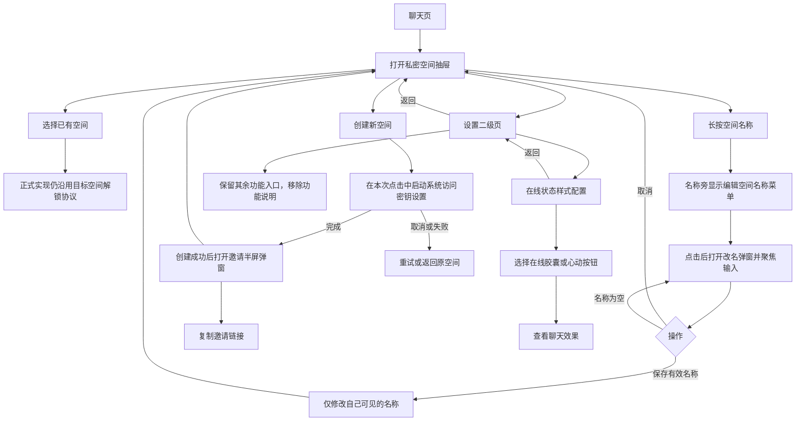

# S6 业务流程

```mermaid
flowchart TD
    A[聊天页] --> B[打开私密空间抽屉]
    B --> C[选择已有空间]
    C --> D[正式实现仍沿用目标空间解锁协议]
    B --> E[长按空间名称]
    E --> F[名称旁显示编辑空间名称菜单]
    F --> G[点击后打开改名弹窗并聚焦输入]
    G --> H{操作}
    H -->|取消| B
    H -->|名称为空| G
    H -->|保存有效名称| I[仅修改自己可见的名称]
    I --> B
    B --> J[创建新空间]
    J --> V[在本次点击中启动系统访问密钥设置]
    V -->|完成| K[创建成功后打开邀请半屏弹窗]
    V -->|取消或失败| W[重试或返回原空间]
    K --> L[复制邀请链接]
    K --> B
    B --> M[设置二级页]
    M --> N[保留其余功能入口，移除功能说明]
    M --> O[在线状态样式配置]
    O --> Q[选择在线胶囊或心动按钮]
    Q --> R[查看聊天效果]
    O -->|返回| M
    M -->|返回| B
```

原型为内存模拟；正式实现复用原有访问密钥、保险库及邀请协议。跨浏览器接入与加密恢复方案本次不实施。
