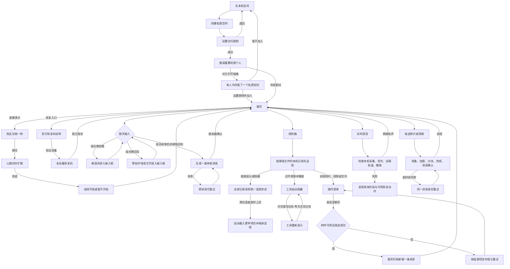

# 交互与诊断流程 S2

此图对应 [需求记录](README.md) 和 [可交互原型](prototype/index.html)。其中通话、上传、输入法候选及本机保险箱内容均为模拟状态，不能作为真实设备或网络验证。

补充约束：锁定、失焦或离开保险箱立即清理模拟敏感状态；真实产品实施时继续遵循现有密文验证、设备授权、恢复和历史边界。键盘候选的系统行为必须在目标浏览器实测，原型只展示预期结果。
