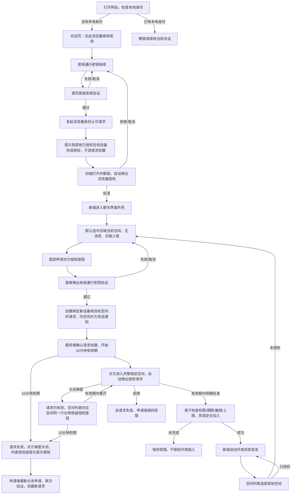

# 浏览器身份认可与逐空间对方授权 · S5

2026-09-22 用户明确纠正：旧端批准不接入任何空间；进入聊天外壳后由各空间对方按需授权。此定义取代 S1/S2 中旧端批准可授予空间成员资格的流程。

## 状态与边界

- 浏览器身份认可仅允许进入界面及取得已授权的必要加密目录信息/默认选中提示，不签发任何空间消息权限。等待页和批准弹窗不显示“此次接入空间”。旧端背景可以显示自身当前空间。
- 旧端当前空间 ID 只是默认选中提示，不作为空间成员授权。新端没有有效空间授权时不能读取消息、展示历史预览、订阅消息或发送；输入区域替换为申请按钮。
- 通行密钥验证通过才创建并向对方通知。通知采用最小内容，锁屏不披露空间名称、身份材料或聊天内容。推送只是提醒，不是授权凭证；未收到推送时，对方进入并解锁目标空间仍能发现有效请求。
- 申请与批准绑定同一 requestId、空间、参与者、目标设备公钥及有效期。10 分钟以服务端创建时间计算，批准端执行原子到期检查；界面倒计时只是显示，不作为唯一安全判断。正式实现不得因刷新、重复通知或重开弹窗延长有效期。
- 对方关闭只收起弹窗，不拒绝、不批准；列表内同一请求可重开。拒绝、申请方取消、撤销、过期均阻止迟到批准；并发申请需去重，不由重复点击获得多个设备席位。
- 每人每空间三台独立设备上限仍保留。空间 A 获准不让 B 获准。原端继续使用，新端默认仅接收加入后的消息。
- “恢复空间”继续是独立的一个总恢复码、双方确认、旧设备退出流程；本轮三条原型聚焦正常浏览器/空间授权，不将正常接入改称恢复，不改变恢复契约。

## S5 修订

- 删除 S4 旧浏览器/宿主 App 选择与唤起流程，不枚举旧浏览器，不展示 Telegram/Mini App 入口；验证后直接提示前往其他已授权在线设备解锁并完成授权。
- 对方空间列表：空间名称与授权按钮在同一行，按钮在右侧，不新增一行。
- 关闭弹窗不拒绝，在有效期内仍可由同一行授权按钮重新打开。
- 10 分钟到期时，对方已打开的授权弹窗自动关闭，聊天界面与空间列表不再保留授权/过期信息或按钮；申请端保留重新申请入口，须重新验证。
- 移除可见提示不等于仅隐藏安全检查，服务端仍须原子拒绝过期与迟到批准。

## 已确认的存量空间升级

- 旧设备在正常解锁空间后，为本方身份建立“仅可申请加入”的签名证书，并更新独立加密接入目录。不会一次解锁其他空间，也不读取其他保险库的私钥。
- 尚未准备的空间保留列表入口，提示先在原设备打开；准备后新端刷新该目录即可继续申请，无需重新认可浏览器。
- 自有旧设备必须曾解锁准备过选中的通行密钥对应目录，且当前已解锁联网；网页不能扫描操作系统中的其他浏览器。凭据/PRF 不可用时保持受限，不自动切换到恢复。
