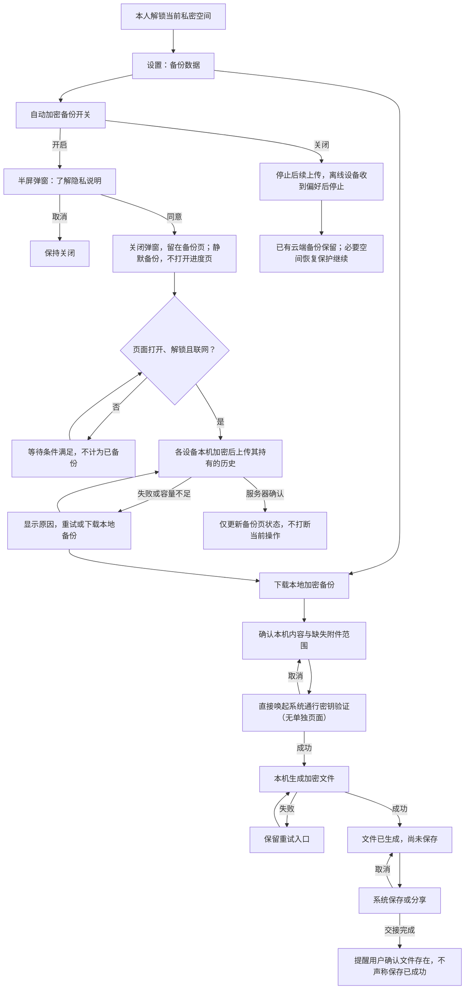
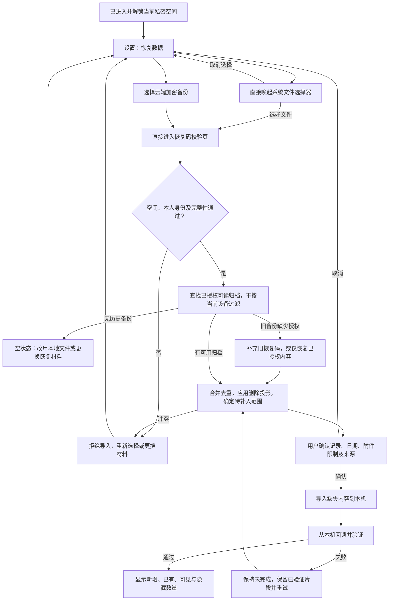
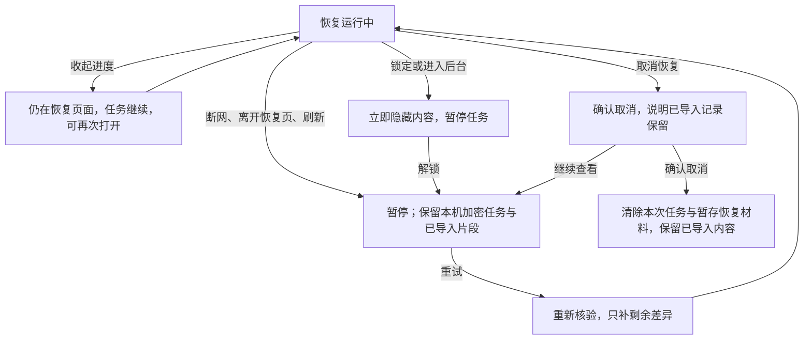

# 备份与恢复业务流程 · v2

与 [交互原型](prototype/index.html) 同版；[离线可查看的流程图](prototype/flow.html) 为以下逻辑的 HTML 排版渲染，无外部依赖。

## F1：备份

## F2：恢复与跨设备授权

## F3：中断、锁定与取消

## 边界

- 云端只处理密文及必要元数据；恢复码和解密密钥不得交由平台托管。
- 开关只控制聊天历史备份。空间身份恢复保护独立；关闭不是删除云端既有内容。
- 同一空间、同一人、有效解密与授权材料三者缺一不可；来源设备不同不构成拒绝条件。
- 新增设备不自动获得旧历史。恢复历史不执行身份替换、双方共同恢复或旧设备撤销。
- 本地文件只覆盖其包含的内容；云端不保证最新记录已备份，也不保证附件原件永久可用。
- 创建者保险箱按现有权限和删除投影恢复，受邀者不获得该入口；草稿、收藏、置顶不纳入。
- 原型文件选择使用系统选择器，仅接收文件名，选择后立即丢弃 File 引用，不读取文件内容、不上传。系统验证和保存仍为模拟按钮，内存状态刷新后重置。正式产品需加密持久化中断任务；不以原型证明密码学、存储或真机行为。

## v2 交互修订

- 开启开关先弹出半屏说明，关闭、暂不开启或 Escape 均保持开关关闭；确认后关闭弹窗并保持备份页。
- 云备份独立异步运行，不再进入备份进度页；暂停、错误和成功仅用原页的一行状态反馈，错误提供重试。离开备份页不强制跳回。
- 主页面仅保留两种方式、简短说明及开关/下载按钮。详细隐私内容在半屏弹窗展开，默认内容优先一屏。
- 本地恢复点击即弹出系统选择器，取消留在原页；选好文件直接进入恢复码页，不再设置中间介绍页。
