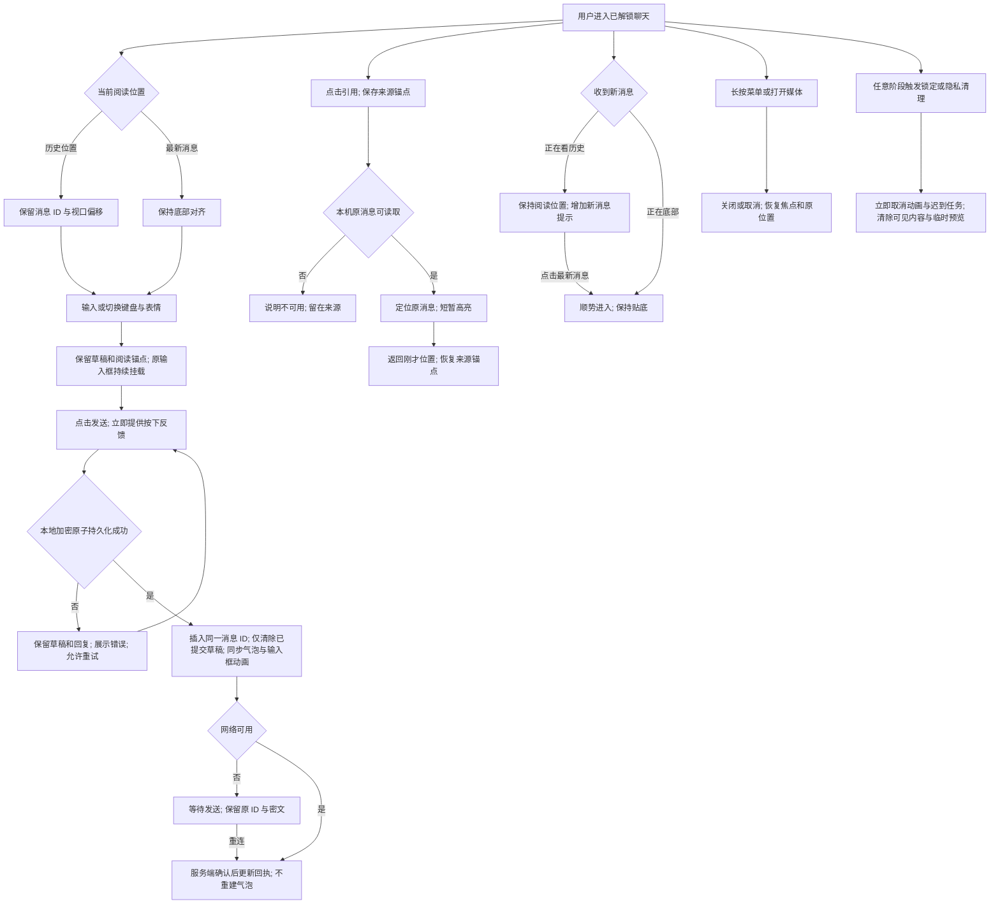

# V1 聊天连续性交互流程

下图对应原型六个场景。可视化预览：[flow.html](prototype/flow.html)。模拟数据不参与真实加密、持久化、回执、跨设备或权限验证。

## 分支补充

- 滑动回复：原型以 64 CSS px 原始位移展示触发点，低于触发点松手或 pointercancel 不回复；纵向滚动优先，命中引用、回应、文字选择时不接管。正式阈值须结合真机小屏试验，不能把模拟阈值当作已确认生产参数。
- 连续发送：以提交时的草稿版本和回复目标快照为边界；保存后新增的输入不得被清除。IME 组合输入期间 Enter 不发送。
- 新消息数量：仅为当前视图未查看的新消息提示，不更改跨设备未读／加密已读的既有协议。
- 表情／媒体：占位尺寸先确定，失败保留重试入口；表情面板保留分类与位置；原型用 emoji 与 CSS 示意图片代替真实资源。
- 返回来源：本次页面内保留有限返回栈，锁定、换空间和离开聊天清理；来源被删除时以相邻有效消息为回退方案，不展示旧内容。
- 图片关闭：本原型直接回到原缩略图位置，优先验证锚点和无闪现；共享元素反向动画为正式实施时的渐进增强，缺失来源时直接关闭。
- 键盘：原型支持键盘占位切换和打开时滚动消息；不能模拟 Safari 系统键盘逐帧拖拽。正式方案使用系统支持范围内的滚动／收起衔接，不承诺访问 UIKit 时钟。
