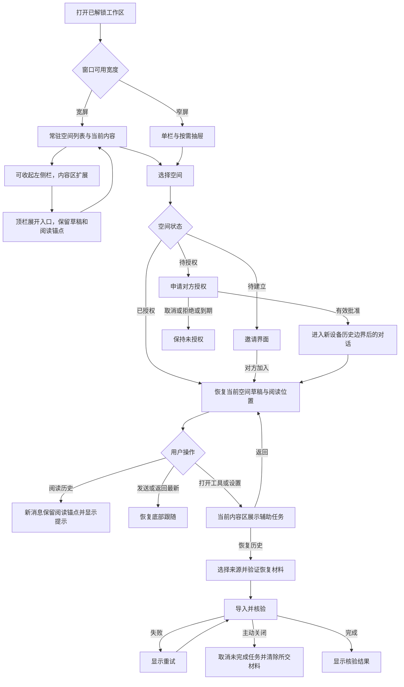

# PC 适配 V1.1 业务流程（待审）

对应 `prototype/index.html` 顶部“业务流程”。所有数据和授权均为模拟。

## 隐私生命周期

- 正式实现沿用既有失焦、隐藏、锁定、桌面会话恢复规则；任何新容器都在遮蔽和清理范围内。
- 用户主动关闭恢复弹窗是取消；真实导航、锁定等生命周期的暂停逻辑沿用原契约。此原型不模拟全部持久化行为。
- 本原型顶部“隐私遮蔽”只展示整体覆盖和焦点隔离；“返回原型”不代表认证。
- 侧栏预览不生成已读；模拟批准不执行 MLS、WebAuthn 或真实设备加入。
