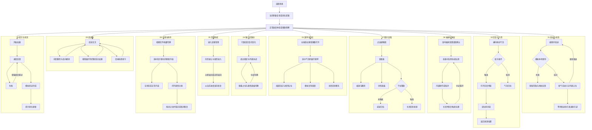

# 十组交互流程 · V1

对应原型 `prototype/index.html`。所有业务结果为模拟；隐私遮挡从任何节点立即终止展示与待处理回调。

```mermaid
flowchart TD
  Select[选择场景] --> Mode[当前参数复现或优化提案]
  Mode --> Play[正常速度体验或慢放观察]
  Play --> S1
  Play --> S2
  Play --> S3
  Play --> S4
  Play --> S5
  Play --> S6
  Play --> S7
  Play --> S8
  Play --> S9
  Play --> S10
  subgraph G1[01 发送与状态]
    S1[编辑并发送] --> Save{模拟本地保存}
    Save -->|失败| Draft[保留草稿与失败反馈]
    Save -->|成功| Enter[新气泡进入与列表让位]
    Enter --> Pending[等待发送到已发送到已读]
    Enter -->|继续发送| S1
  end
  subgraph G2[02 回复与引用]
    S2[横向拖动气泡] --> Release{松手条件}
    Release -->|触发| Reply[打开回复预览]
    Release -->|取消| Settle[气泡归位]
    Reply --> Quote[定位原消息]
    Quote --> Return[返回来源位置]
  end
  subgraph G3[03 菜单与回应]
    S3[长按或右键或键盘打开] --> Menu[选中气泡并展开菜单]
    Menu --> React[局部回应与相邻让位]
    Menu --> Copy[模拟复制反馈]
    Menu --> Cancel[关闭回到聊天]
  end
  subgraph G4[04 输入区联动]
    S4[行数或回复栏变化] --> Layout[底边稳定与列表协调]
    Layout --> Panels[键盘占位与表情面板切换]
    Panels -->|中途切换| Layout
  end
  subgraph G5[05 页面导航]
    S5[进入设备管理] --> Push[前页退让与新页进入]
    Push -->|立即返回或正常返回| Pop[从当前进度反向恢复]
  end
  subgraph G6[06 抽屉与弹层]
    S6[空间抽屉或邀请或确认] --> Surface[容器与背景协调出现]
    Surface --> Operation[内部操作或取消]
    Operation --> Exit[关闭并恢复触发位置]
    Exit -->|中途重开| Surface
  end
  subgraph G7[07 图片查看]
    S7[点击缩略图] --> Viewer[查看器]
    Viewer --> Zoom[缩放与翻页]
    Viewer --> Detail[详情面板]
    Viewer --> Drag{下拉释放}
    Drag -->|未触发| Home[减速归位]
    Drag -->|触发| Origin[关闭回到来源]
  end
  subgraph G8[08 分类与排序]
    S8[相册文件收藏切换] --> Indicator[选中指示移动并更新内容]
    Indicator --> Empty[空状态或正常内容]
    Indicator --> Packs[打开表情分类]
    Packs --> Reorder[拖动让位并落定或取消恢复]
  end
  subgraph G9[09 阅读器]
    S9[阅读正文] --> Page[前后翻页与反向接续]
    S9 --> Search[搜索展开到匹配或无结果]
    S9 --> Directory[目录选择章节]
    Page --> S9
    Search --> S9
    Directory --> S9
  end
  subgraph G10[10 提示与状态]
    S10[开始加载] --> Progress[进度反馈]
    Progress --> Failure[失败]
    Failure -->|保留进度重试| Progress
    Progress --> Success[模拟验证完成]
    Success --> Notice[提示原位更新]
  end
```
