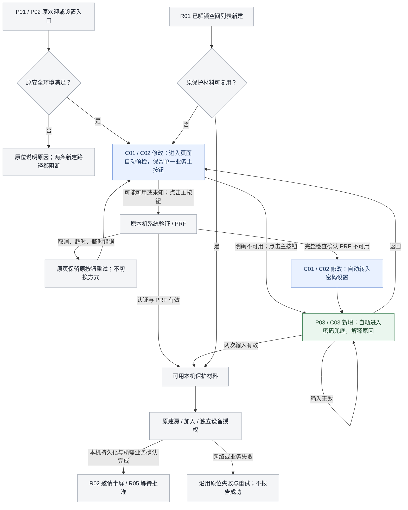
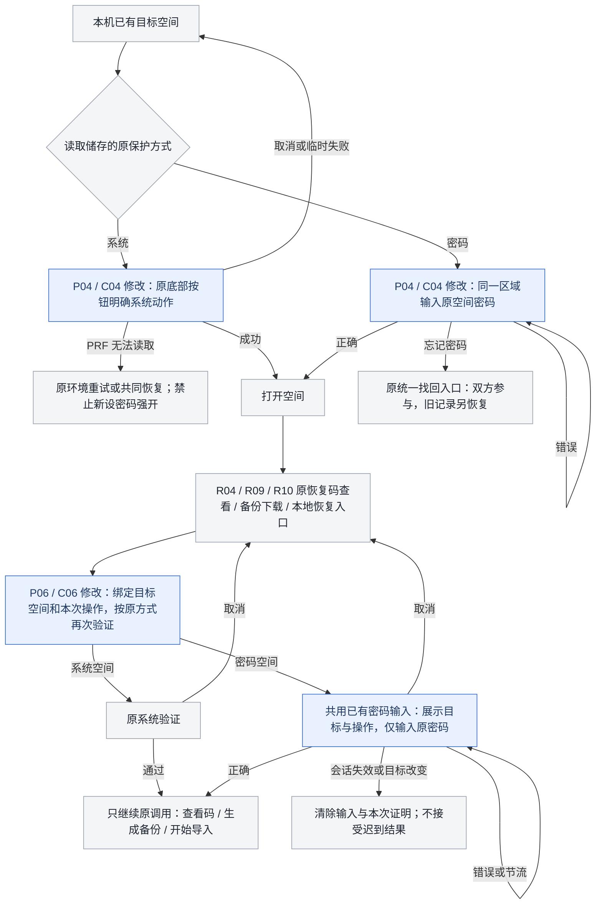
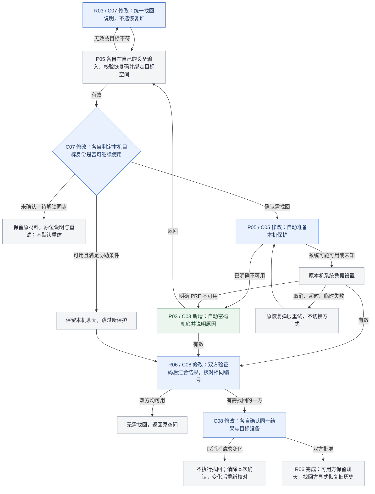

# 无通行密钥路径 · 自动兜底与访问闭环业务流程 v7

与[方案](README.md)、[标注原型](prototype/index.html)、[可交互流程图](prototype/index.html?page=flow)同版。**灰色复用、蓝色修改、绿色新增**；页面与流程共用 C01–C08。用户不选择保护方式，密码仅为自动兜底。

## 变动点索引

| 改动 | 页面 | 当前变化 |
| --- | --- | --- |
| C01 | P01 欢迎 | 单一创建动作与自动兜底；删除解锁动作预告，更新两项找回文案 |
| C02 | P02 共用设置 | 创建／受邀／设备／修复共用自动分流；无方式预告和用户选择 |
| C03 | P03 密码表单 | 仅系统保护明确不可用时自动进入；支持密码管理器与准确长度／不一致提示 |
| C04 | P04 解锁底部 | 读取原保护方式；密码空间明确目标与忘记密码路径，不随当前能力重新选方式 |
| C05 | P05 原恢复码弹层 | 恢复新设备自动判定；只协助对方跳过保护设置 |
| C06 | P06 验证已有密码 | 共用弹层在导航中直接可见；恢复码、备份下载、本地恢复调用示例补齐，错误／取消／失效不执行 |
| C07 | R03 找回说明 / P05 | 删除恢复对象单选；各自校验自己的码后绑定目标，判定本机状态 |
| C08 | R06 双方参与与结果 | 显示保留／找回结果，复用原确认按钮，双方批准同一请求后执行 |

## F1 新设备创建、加入与修复

客户端能力探测不保证具体凭据 PRF 可用；探测缺失／未知继续系统尝试。原生窗口仍由点击触发。取消或原因不唯一的错误不等于不支持；安全完整性失败不进入密码兜底。没有通用选择页或自主密码入口。

## F2 本机已有空间解锁与敏感再次验证

[直接预览 P06](prototype/index.html?page=reauth) 可切换恢复码、备份下载、本地恢复、旧版入口、必要目标凭据五种调用示例。P04 是解锁空间，P03 是设置新密码，P06 是业务操作验证已有密码；它们不会混用。取消返回原业务摘要，旧版入口取消仍锁定；删除另一个待建立空间只在原规则需要目标证明时验证其凭据，后台不弹验证。

新设备保护按能力自动判定；已有密文必须按原方式打开。检测结果变化不导致自动迁移、重新加密或新增密码包装。隐私遮蔽与锁定沿用最新 main，能力检测不是认证。

v7 增补：P03 新密码与 P04／P06 已有密码采用对应的密码管理器填写语义，允许粘贴；显示／隐藏不丢输入，页面离开清除输入。P04 明确目标空间和忘记密码入口，复用 F3，不新增服务端重置。P06 成功仅继续当前空间的当前操作，不能用现有会话的快捷返回代替新鲜验证。模拟长度按 Unicode 码点示意，正式上限及派生参数仍待确认。

## F3 统一找回与共同确认

[直接预览统一找回](prototype/index.html?page=restore&v=6)。双方各自输入码用于身份认证；系统各自检查本机状态后汇合结果，不能在页面进入时猜对方是否丢失。原型外部的五种状态只用于模拟，产品里没有该选择器。双方均可用时在结果汇合后停止，不需要准备新保护。

C07 去掉前置对象单选；C08 在现有共同恢复页复用确认按钮，展示可用方保留聊天／找回方另恢复历史及其他旧设备需重新授权，再确认。当前正式代码稳定范围可自动签署；v6 移除前置选择后采用结果确认。内部需要重建／协助的区别仍保留；不知道状态、取消系统验证或临时失败不自动标为丢失。码、请求、目标、设备变化拒绝迟到结果。恢复码和双方批准授予权限；密码只保护本机保险库。

## R07 目录识别与其他复用边界

现有浏览器目录识别依赖原可发现系统凭据和 PRF，不在本期增加密码远端目录发现。本机有密码保险库时走 P04；无本机数据且无原凭据时使用既有设备邀请或共同恢复。邀请半屏、成员批准、设备限制、历史恢复及邀请／恢复二维码仍沿用。新建系统凭据不主动提供扫码／USB 高级路径。

欢迎页按钮改为“使用设备密钥找回空间”“使用恢复码找回空间”。“设备密钥”仍指原可发现系统凭据；不新增物理设备全量枚举或密码目录识别。C01、C02 不预告面容／指纹等具体验证方式。
