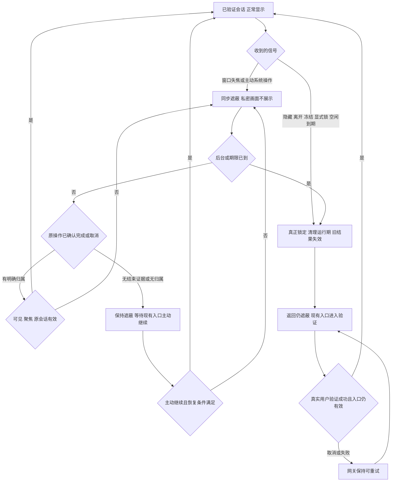

# H5 遮蔽流程 V2

```mermaid
flowchart TD
  A[已验证会话 正常显示] --> B{收到的信号}
  B -->|窗口失焦或主动系统操作| C[同步遮蔽 私密画面不展示]
  B -->|隐藏 离开 冻结 显式锁 空闲到期| L[真正锁定 清理运行期 旧结果失效]
  C --> D{后台或期限已到}
  D -->|是| L
  D -->|否| E{原操作已确认完成或取消}
  E -->|有明确归属| F{可见 聚焦 原会话有效}
  F -->|是| A
  F -->|否| C
  E -->|无结束证据或无归属| G[保持遮蔽 等待现有入口主动继续]
  G --> H{主动继续且恢复条件满足}
  H -->|是| A
  H -->|否| C
  L --> I[返回仍遮蔽 现有入口进入验证]
  I --> J{真实用户验证成功且入口仍有效}
  J -->|是| A
  J -->|取消或失败| K[网关保持可重试]
  K --> I
```

优先级：真正锁定信号高于任何系统操作与回焦。操作归属不是认证。已持久化业务记录不因临时遮蔽回滚。已提交给系统的授权输出不在 H5 页面遮蔽范围。
