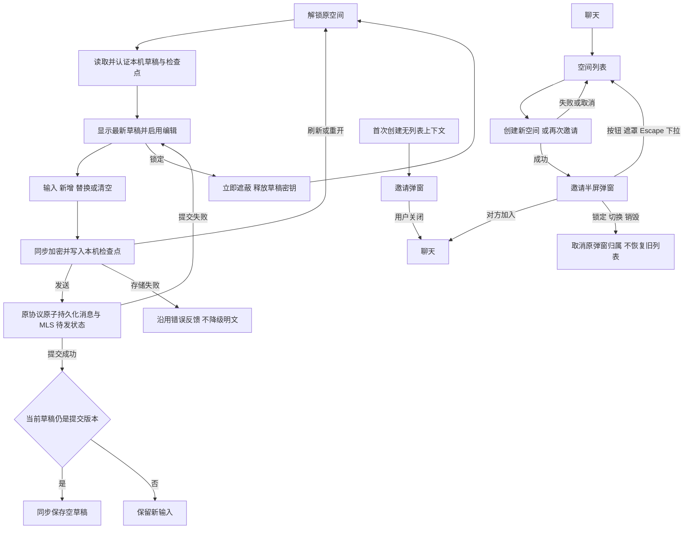

# V1 修复流程

```mermaid
flowchart TD
    A[解锁原空间] --> D[读取并认证本机草稿与检查点]
    D --> E[显示最新草稿并启用编辑]
    E --> F[输入 新增 替换或清空]
    F --> G[同步加密并写入本机检查点]
    G -->|刷新或重开| A
    G -->|发送| H[原协议原子持久化消息与 MLS 待发状态]
    H -->|提交失败| E
    H -->|提交成功| I{当前草稿仍是提交版本}
    I -->|是| J[同步保存空草稿]
    I -->|否| K[保留新输入]
    G -->|存储失败| L[沿用错误反馈 不降级明文]
    E -->|锁定| M[立即遮蔽 释放草稿密钥]
    M --> A
    N[聊天] --> O[空间列表]
    O --> P[创建新空间 或再次邀请]
    P -->|失败或取消| O
    P -->|成功| Q[邀请半屏弹窗]
    Q -->|按钮 遮罩 Escape 下拉| O
    Q -->|对方加入| R[聊天]
    Q -->|锁定 切换 销毁| S[取消原弹窗归属 不恢复旧列表]
    T[首次创建无列表上下文] --> U[邀请弹窗]
    U -->|用户关闭| R
```

可视流程见 [原型流程页](prototype/flow.html)。本图定义验收结果；原型仅演示邀请路径，草稿加密与实际持久化需正式实现验证。
