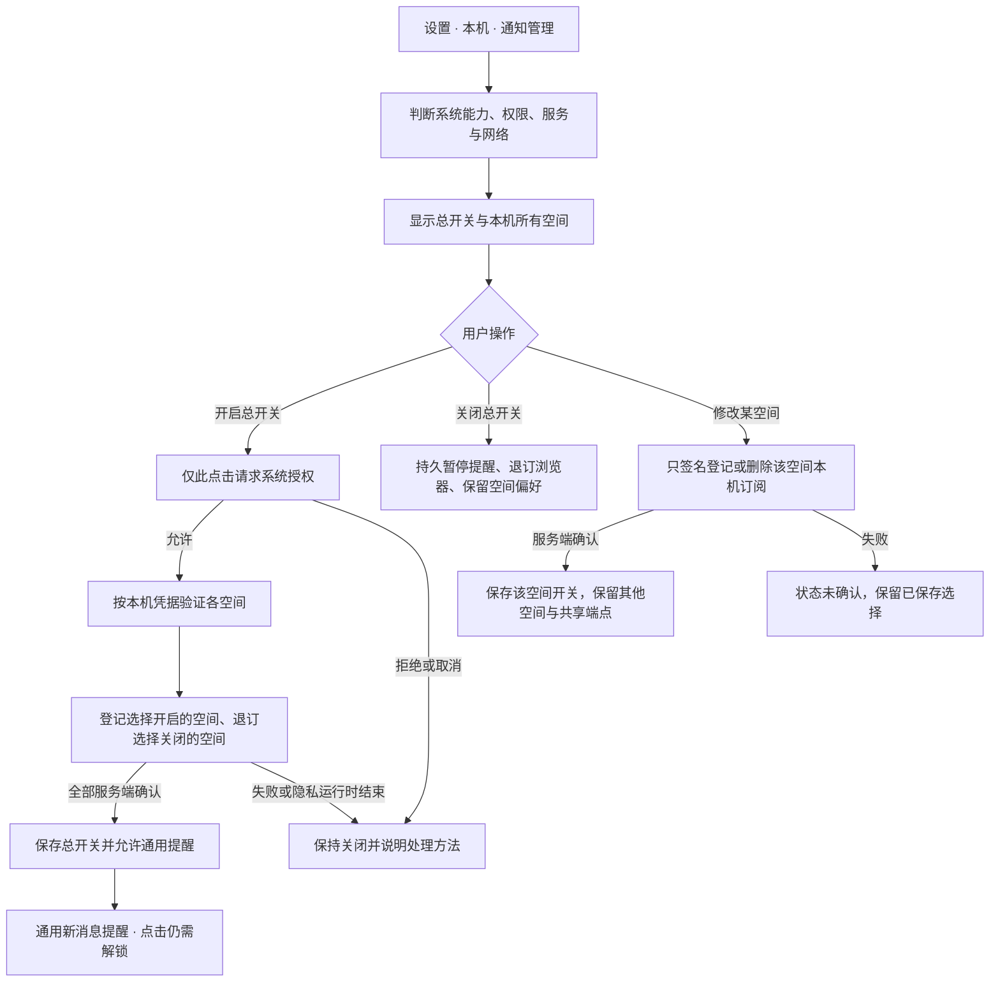

# 通知 v2 实施流程

```mermaid
flowchart TD
  A[设置 · 本机 · 通知管理] --> B[判断系统能力、权限、服务与网络]
  B --> C[显示总开关与本机所有空间]
  C --> D{用户操作}
  D -->|开启总开关| E[仅此点击请求系统授权]
  E -->|允许| F[按本机凭据验证各空间]
  F --> G[登记选择开启的空间、退订选择关闭的空间]
  G -->|全部服务端确认| H[保存总开关并允许通用提醒]
  E -->|拒绝或取消| I[保持关闭并说明处理方法]
  G -->|失败或隐私运行时结束| I
  D -->|关闭总开关| J[持久暂停提醒、退订浏览器、保留空间偏好]
  D -->|修改某空间| K[只签名登记或删除该空间本机订阅]
  K -->|服务端确认| L[保存该空间开关，保留其他空间与共享端点]
  K -->|失败| M[状态未确认，保留已保存选择]
  H --> N[通用新消息提醒 · 点击仍需解锁]
```

实际隐藏、锁定或离开后取消页面工作；迟到授权不得开放新运行时的提醒。主屏幕安装和真实系统面板不由原型或浏览器夹具证明。
