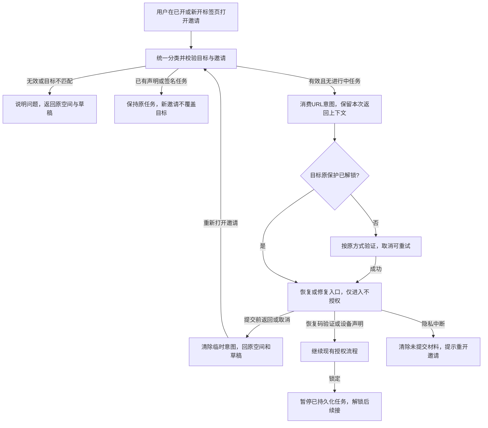
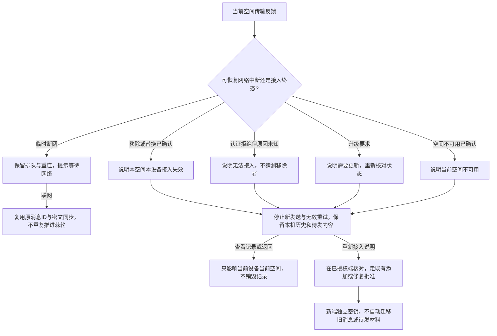
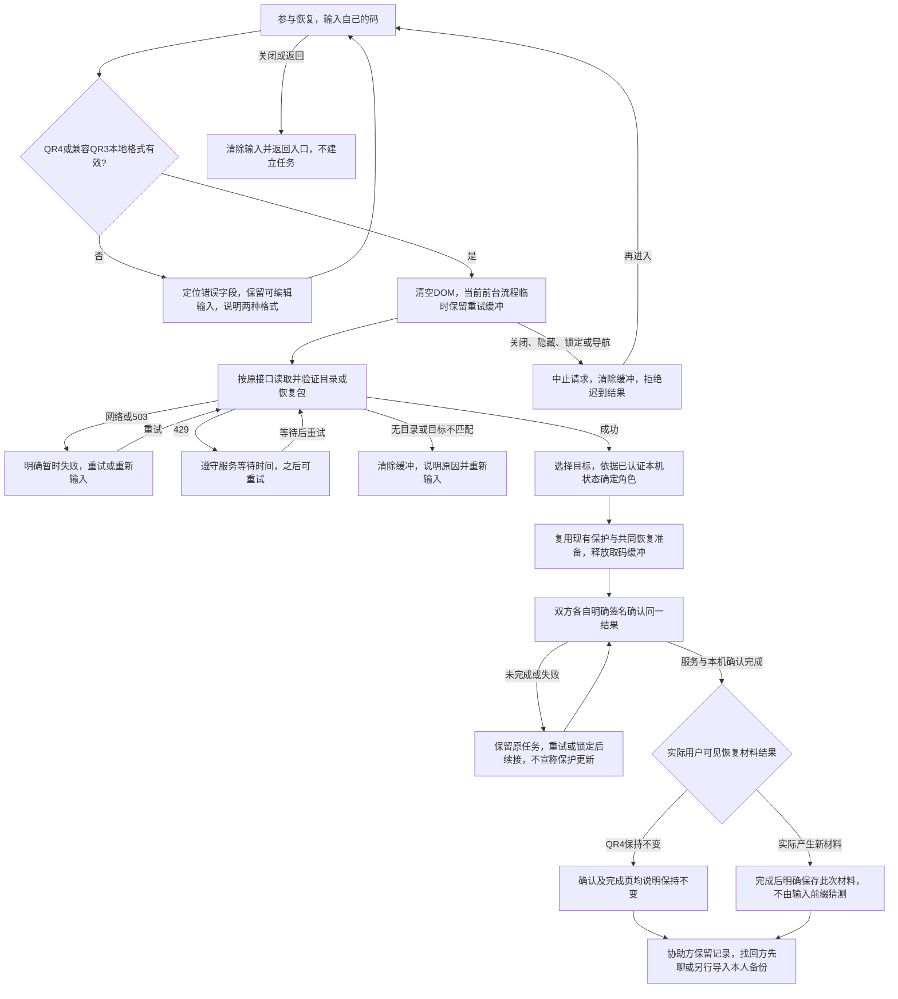
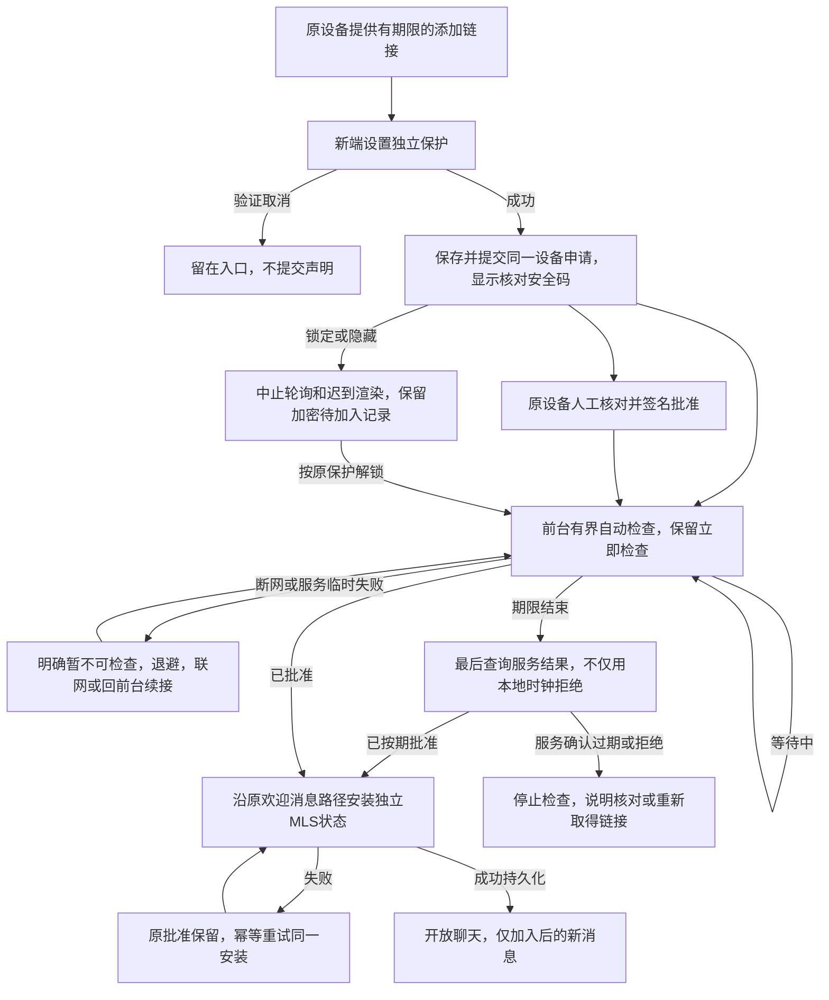

# 交互优化业务流程 v1

基线：`189912f3eaea71215e1dc4958e5ff50c084bbcfa`。与[可交互原型](prototype/index.html)同步。
[可视化流程](flow.html)为下列关键节点及分支的 HTML 对照呈现，不依赖在线 Mermaid 服务。
所有验证／授权／持久化节点在原型中均为模拟；不能以演示结果替代真实协议证据。

## I1：邀请进入与返回

## I5：连接事实与授权终态

## I2 / I4：恢复重试与材料结果

## I3：普通新增设备等待

约束：自动与手动检查共用单请求链；锁定不是撤销声明；批准主体与每人每空间三台上限不变。
