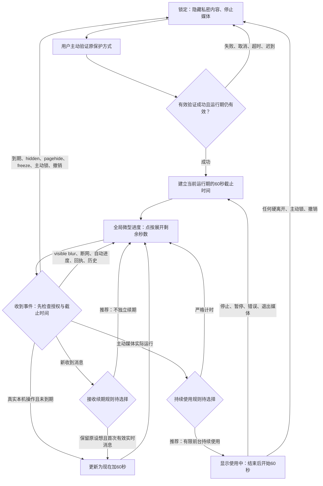

# 全局自动锁定流程 V2（待确认）

参与者：本机用户、浏览器文档、应用授权控制器、原本机保护验证、消息／媒体运行期。
前置条件：当前空间采用原保护方式；未验证时没有私密内容。接收消息续期、持续媒体建议待确认。

V2 视觉：正常中性细线，最后 10 秒柔和暖色，不常驻秒数；时间仍按实际截止时刻判断，t≤0 锁。此呈现变更待确认。
跨页面共享 C/W 的截止时间；内部导航是用户操作 R，页面挂载本身不触发 R。
多设备／多标签不共享解锁授权；主动锁可广播同保险库失效信号。刷新／BFCache 返回从 L 开始。
可见桌面失焦不能证明人离开，此时继续倒计时；不能承诺所有应用切换立即可检测。
锁定先失效与遮蔽，再清理明文引用／URL／媒体／任务；原加密草稿与已原子提交的密文沿现有契约保存。失败关闭，不接入旧运行期晚到结果。

离线可查看简图：[flow.html](prototype/flow.html)。完整边界与验收见[方案](README.md)。
