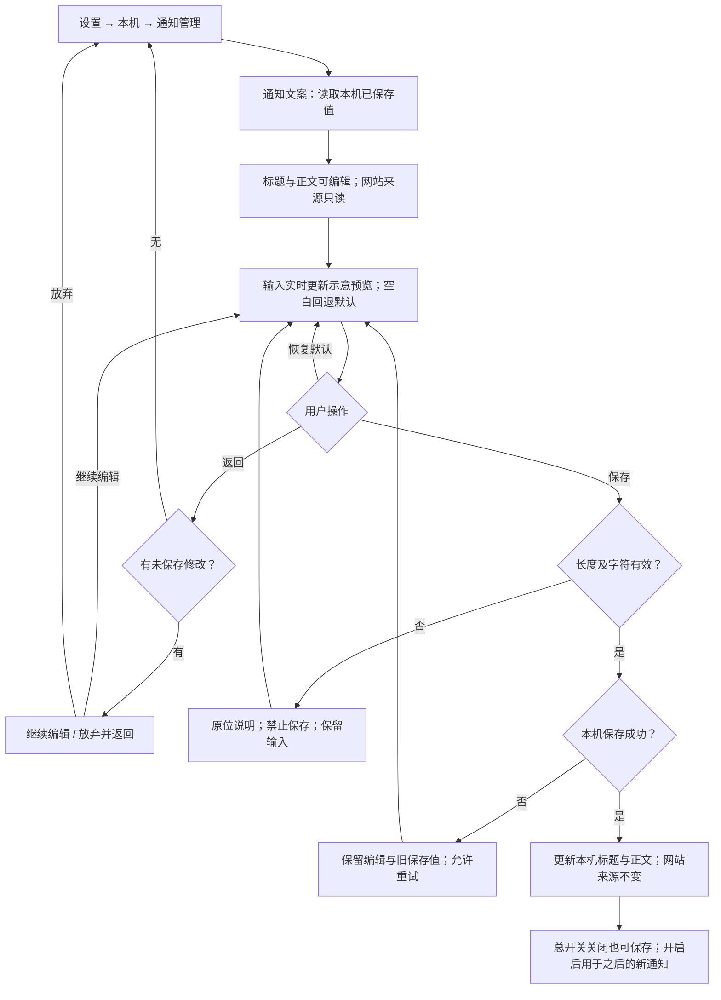
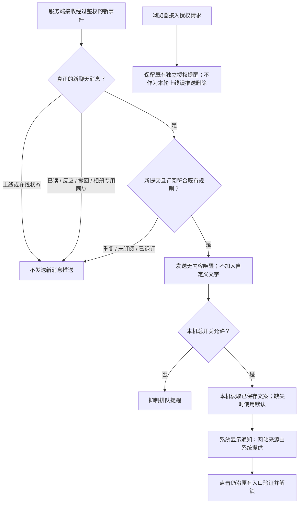

# 通知文案 v1 业务流程

[可查看的流程图](prototype/flow.html) · [原型](prototype/index.html)

```mermaid
flowchart TD
  A[设置 → 本机 → 通知管理] --> B[通知文案：读取本机已保存值]
  B --> C[标题与正文可编辑；网站来源只读]
  C --> D[输入实时更新示意预览；空白回退默认]
  D --> E{用户操作}
  E -->|恢复默认| D
  E -->|返回| F{有未保存修改？}
  F -->|无| A
  F -->|有| G[继续编辑 / 放弃并返回]
  G -->|继续编辑| D
  G -->|放弃| A
  E -->|保存| H{长度及字符有效？}
  H -->|否| I[原位说明；禁止保存；保留输入]
  I --> D
  H -->|是| J{本机保存成功？}
  J -->|否| K[保留编辑与旧保存值；允许重试]
  K --> D
  J -->|是| L[更新本机标题与正文；网站来源不变]
  L --> M[总开关关闭也可保存；开启后用于之后的新通知]
```

```mermaid
flowchart TD
  N[服务端接收经过鉴权的新事件] --> O{真正的新聊天消息？}
  O -->|上线或在线状态| P[不发送新消息推送]
  O -->|已读 / 反应 / 撤回 / 相册专用同步| P
  O -->|是| Q{新提交且订阅符合既有规则？}
  Q -->|重复 / 未订阅 / 已退订| P
  Q -->|是| R[发送无内容唤醒；不加入自定义文字]
  R --> S{本机总开关允许？}
  S -->|否| T[抑制排队提醒]
  S -->|是| U[本机读取已保存文案；缺失时使用默认]
  U --> V[系统显示通知；网站来源由系统提供]
  V --> W[点击仍沿原有入口验证并解锁]
  X[浏览器接入授权请求] --> Y[保留既有独立授权提醒；不作为本轮上线误推送删除]
```

流程表达方案，不代表服务端、系统通知或真实设备已实现／验证。现有 `countUnread` 能表达非聊天同步的计数属性；正式实现时须核实鉴权、旧客户端、消息重试和既有授权请求，不能读取或按明文解释密文。
