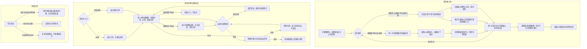

# 输入区与首次密钥页业务流程 V1

[查看渲染图](flow.html) · [打开原型](prototype/index.html)

```mermaid
flowchart TD
  subgraph A[聊天输入区]
    A0[已解锁聊天，保留原输入节点及草稿] --> A1{用户操作}
    A1 -->|表情或工具展开时点击输入框| A2[在真实用户手势内请求键盘]
    A2 --> A3[旧面板立即停止交互，原位渐隐]
    A2 --> A4[输入栏直接从当前绘制位置前往键盘上方]
    A1 -->|键盘展开时点击表情| A5[同一手势收键盘并挂载表情]
    A5 --> A6[表情从底部进入，键盘向下退出]
    A6 --> A7[实测键盘高度优先，否则有界回退]
    A3 --> A8[统一结算占位与列表锚点，无中间回落]
    A4 --> A8
    A7 --> A8
    A8 --> A9[底部阅读自然跟随，历史行为沿用现有契约]
    A9 --> A10[面板与底部安全区同色连续]
    A8 -->|途中反向| A1
  end
  subgraph B[首次创建与受邀加入]
    B0{原业务入口} -->|创建| B1[每次打开，先确认是你]
    B0 -->|有效邀请| B2[加入私密空间]
    B1 --> B3[统一本地锁插图，标题说明，名称，底部动作]
    B2 --> B3
    B3 -->|短屏或文字放大| B4[缩小或隐藏装饰，正文滚动，动作可达]
    B3 -->|返回或暂不加入| B5[回原入口，不提交]
    B4 --> B6{点击原设置按钮}
    B3 --> B6
    B6 -->|名称无效| B7[就近错误，保留内容供修正]
    B7 --> B3
    B6 -->|有效| B8[原保护能力与系统认证流程]
    B8 -->|取消| B3
    B8 -->|失败| B9[保留名称，显示真实错误，可重试]
    B9 --> B6
    B8 -->|成功| B10[原创建或加入后聊天流程]
  end
  subgraph C[全程边界]
    C0[任意状态] -->|锁定或生命周期失效| C1[同步清理面板与敏感运行期，丢弃迟到结果]
    C0 -->|减少动态效果| C2[立即到达可用终态]
    C0 -->|快速重复或反向| C3[复用当前画面，不重播旧起点]
  end
```

只调整页面呈现与输入区交接。首次密码、既有通行密钥、WebView回退及能力检查仍走原分支，不把UA当认证。正式键盘使用原生视口证据；原型绘制键盘不证明真机同步、安全认证或生产实现。
