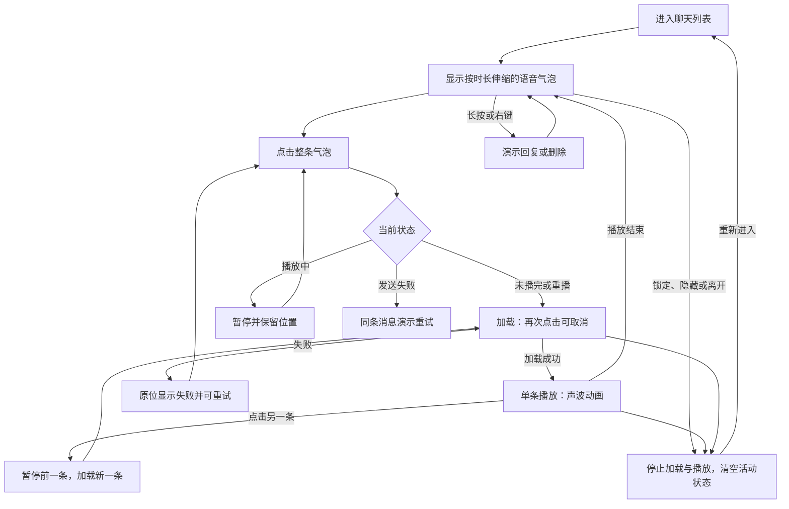
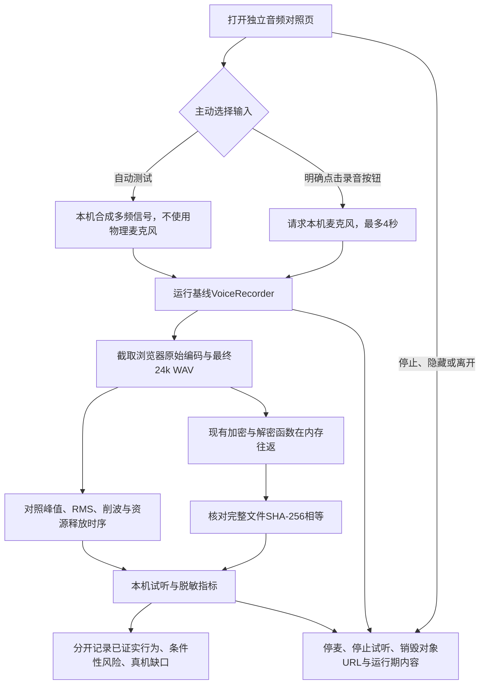

# 微信式语音气泡与音频对照 V1

状态：待设计确认。可查看的同版渲染：[流程图](prototype/flow.html)。
仅使用合成消息；音频诊断仅在独立页面内存运行，不初始化业务入口、不连接聊天、服务器或持久存储。

```mermaid
flowchart TD
  A[进入聊天列表] --> B[显示按时长伸缩的语音气泡]
  B --> C[点击整条气泡]
  C --> D{当前状态}
  D -->|未播完或重播| E[加载：再次点击可取消]
  D -->|播放中| F[暂停并保留位置]
  D -->|发送失败| G[同条消息演示重试]
  E -->|加载成功| H[单条播放：声波动画]
  E -->|失败| I[原位显示失败并可重试]
  I --> C
  F --> C
  H -->|播放结束| B
  H -->|点击另一条| J[暂停前一条，加载新一条]
  J --> E
  B -->|长按或右键| K[演示回复或删除]
  K --> B
  B -->|锁定、隐藏或离开| L[停止加载与播放，清空活动状态]
  H --> L
  E --> L
  L -->|重新进入| A
```

```mermaid
flowchart TD
  A[打开独立音频对照页] --> B{主动选择输入}
  B -->|自动测试| C[本机合成多频信号，不使用物理麦克风]
  B -->|明确点击录音按钮| D[请求本机麦克风，最多4秒]
  C --> E[运行基线VoiceRecorder]
  D --> E
  E --> F[截取浏览器原始编码与最终24k WAV]
  F --> G[对照峰值、RMS、削波与资源释放时序]
  F --> H[现有加密与解密函数在内存往返]
  H --> I[核对完整文件SHA-256相等]
  G --> J[本机试听与脱敏指标]
  I --> J
  J --> K[分开记录已证实行为、条件性风险、真机缺口]
  A -->|停止、隐藏或离开| L[停麦、停止试听、销毁对象URL与运行期内容]
  E --> L
  J --> L
```

气泡原型的加载／重试和隐私转换均为交互演示。真实协议仍由现有附件校验、回执、消息重试及隐私生命周期拥有。已读不表示已听；本原型不新增“已听”回执。
