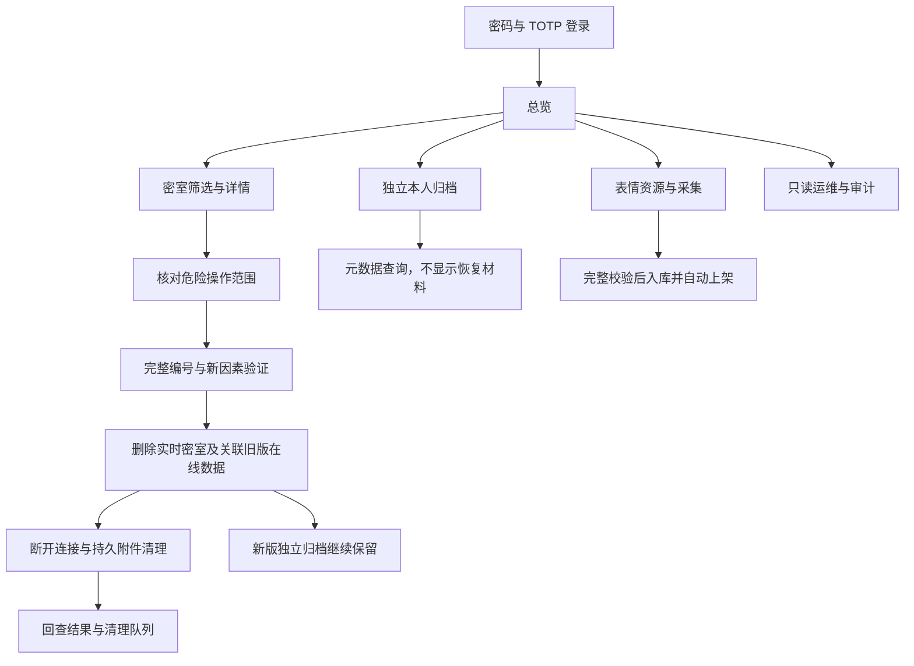

# V1 已确认业务流程

```mermaid
flowchart TD
  A[密码与 TOTP 登录] --> B[总览]
  B --> C[密室筛选与详情]
  B --> D[独立本人归档]
  B --> E[表情资源与采集]
  B --> F[只读运维与审计]
  C --> G[核对危险操作范围]
  G --> H[完整编号与新因素验证]
  H --> I[删除实时密室及关联旧版在线数据]
  I --> J[断开连接与持久附件清理]
  J --> K[回查结果与清理队列]
  I --> L[新版独立归档继续保留]
  D --> M[元数据查询，不显示恢复材料]
  E --> N[完整校验后入库并自动上架]
```

写操作超时先回查，不能自动重放。来源密室消失、旧设备被撤销或归档对象存在，分别只说明相应事实，不代表归档可删除或历史完整。
