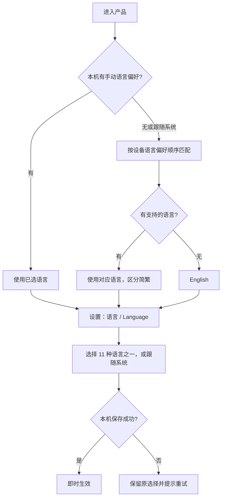
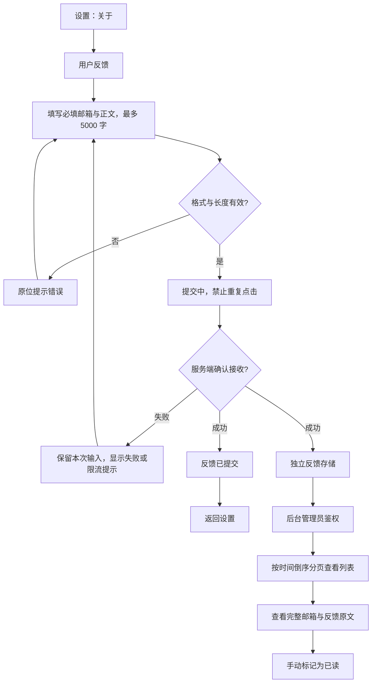

# V1.1 静态流程

```mermaid
flowchart TD
    A[进入产品] --> B{本机有手动语言偏好?}
    B -->|有| C[使用已选语言]
    B -->|无或跟随系统| D[按设备语言偏好顺序匹配]
    D --> E{有支持的语言?}
    E -->|有| F[使用对应语言，区分简繁]
    E -->|无| G[English]
    C --> H[设置：语言 / Language]
    F --> H
    G --> H
    H --> I[选择 11 种语言之一，或跟随系统]
    I --> J{本机保存成功?}
    J -->|是| K[即时生效]
    J -->|否| L[保留原选择并提示重试]
```

```mermaid
flowchart TD
    A[设置：关于] --> B[用户反馈]
    B --> C[填写必填邮箱与正文，最多 5000 字]
    C --> D{格式与长度有效?}
    D -->|否| E[原位提示错误]
    E --> C
    D -->|是| F[提交中，禁止重复点击]
    F --> G{服务端确认接收?}
    G -->|失败| H[保留本次输入，显示失败或限流提示]
    H --> C
    G -->|成功| I[反馈已提交]
    I --> J[返回设置]
    G -->|成功| K[独立反馈存储]
    K --> L[后台管理员鉴权]
    L --> M[按时间倒序分页查看列表]
    M --> N[查看完整邮箱与反馈原文]
    N --> O[手动标记为已读]
```

静态图片见 prototype/index.html 的 `view=flow`；全部为待实施说明，不证明真实接口或权限生效。返回、锁定的未提交草稿边界及数据保留规则仍需在实施前明确。
