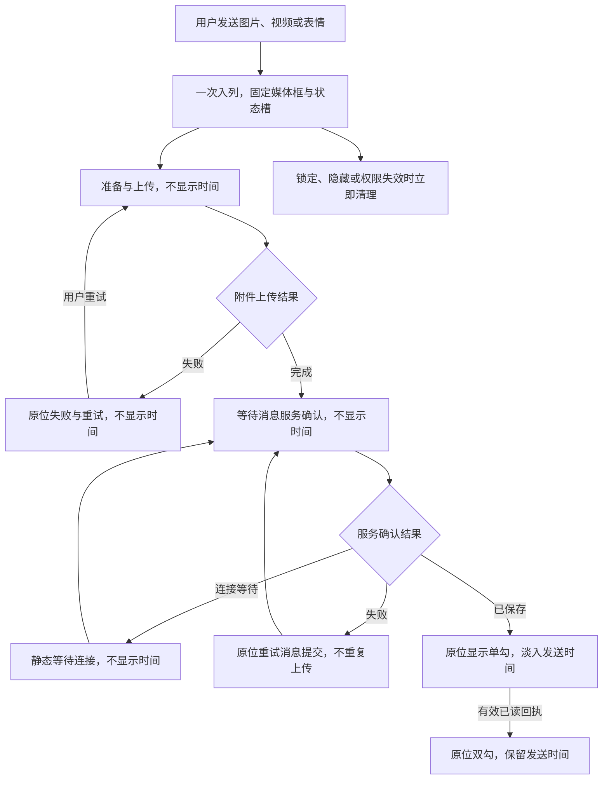

# 媒体发送连续性 V1.1

```mermaid
flowchart TD
  A[用户发送图片、视频或表情] --> B[一次入列，固定媒体框与状态槽]
  B --> C[准备与上传，不显示时间]
  C --> D{附件上传结果}
  D -->|失败| E[原位失败与重试，不显示时间]
  E -->|用户重试| C
  D -->|完成| F[等待消息服务确认，不显示时间]
  F --> G{服务确认结果}
  G -->|连接等待| H[静态等待连接，不显示时间]
  H --> F
  G -->|失败| I[原位重试消息提交，不重复上传]
  I --> F
  G -->|已保存| J[原位显示单勾，淡入发送时间]
  J -->|有效已读回执| K[原位双勾，保留发送时间]
  B --> P[锁定、隐藏或权限失效时立即清理]
```

仅已持久化待发项沿现有协议恢复；未完成上传的演示占位不承诺刷新后恢复。时间取sentAt；收到确认才显示，不将上传100%或预览可用当作发送成功。无回执不推断未读。收到成功确认后本机预览失败不回退发送事实。
