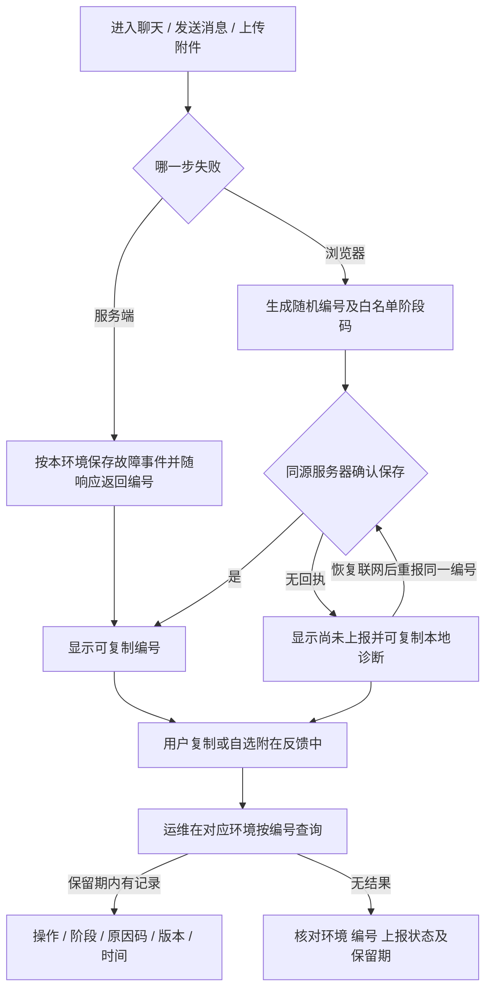

# 故障反馈 V1

[打开可交互预览，选择「业务流程」](prototype/index.html)

```mermaid
flowchart TD
  A[进入聊天 / 发送消息 / 上传附件] --> B{哪一步失败}
  B -->|服务端| C[按本环境保存故障事件并随响应返回编号]
  B -->|浏览器| D[生成随机编号及白名单阶段码]
  D --> E{同源服务器确认保存}
  E -->|是| F[显示可复制编号]
  C --> F
  E -->|无回执| G[显示尚未上报并可复制本地诊断]
  G -->|恢复联网后重报同一编号| E
  F --> H[用户复制或自选附在反馈中]
  G --> H
  H --> I[运维在对应环境按编号查询]
  I -->|保留期内有记录| J[操作 / 阶段 / 原因码 / 版本 / 时间]
  I -->|无结果| K[核对环境 编号 上报状态及保留期]
```
