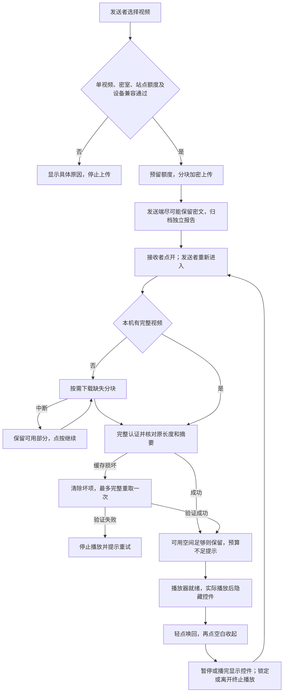

# 视频收发与重播 V1

[打开流程视图](prototype/flow.html)

```mermaid
flowchart TD
  A[发送者选择视频] --> B{单视频、密室、站点额度及设备兼容通过}
  B -->|否| C[显示具体原因，停止上传]
  B -->|是| D[预留额度，分块加密上传]
  D --> E[发送端尽可能保留密文，归档独立报告]
  F[接收者点开；发送者重新进入] --> G{本机有完整视频}
  G -->|否| H[按需下载缺失分块]
  H -->|中断| I[保留可用部分，点按继续]
  I --> H
  H --> J[完整认证并核对原长度和摘要]
  G -->|是| J
  J -->|缓存损坏| K[清除坏项，最多完整重取一次]
  K -->|验证失败| L[停止播放并提示重试]
  J -->|成功| M[可用空间足够则保留，预算不足提示]
  K -->|验证成功| M
  M --> N[播放器就绪，实际播放后隐藏控件]
  N --> O[轻点唤回，再点空白收起]
  O --> P[暂停或播完显示控件；锁定或离开终止播放]
  P --> F
  E --> F
```
