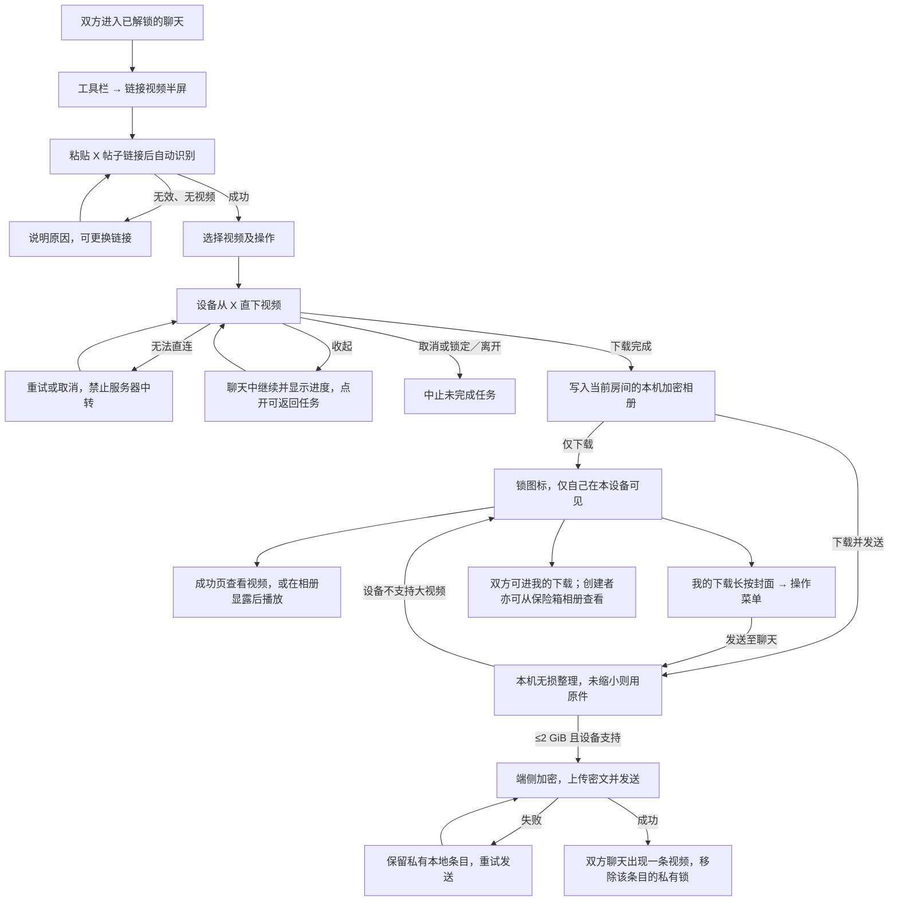

# 链接视频 · 业务流程 V2

```mermaid
flowchart TD
  entry["双方进入已解锁的聊天"] --> tool["工具栏 → 链接视频半屏"]
  tool --> resolve["粘贴 X 帖子链接后自动识别"]
  resolve -->|"无效、无视频"| correct["说明原因，可更换链接"]
  correct --> resolve
  resolve -->|"成功"| selectClip["选择视频及操作"]
  selectClip --> direct["设备从 X 直下视频"]
  direct -->|"无法直连"| retry["重试或取消，禁止服务器中转"]
  retry --> direct
  direct -->|"收起"| compact["聊天中继续并显示进度，点开可返回任务"]
  compact --> direct
  direct -->|"取消或锁定／离开"| stop["中止未完成任务"]
  direct -->|"下载完成"| local["写入当前房间的本机加密相册"]
  local -->|"仅下载"| privateAlbum["锁图标，仅自己在本设备可见"]
  local -->|"下载并发送"| pack["本机无损整理，未缩小则用原件"]
  pack -->|"设备不支持大视频"| privateAlbum
  pack -->|"≤2 GiB 且设备支持"| send["端侧加密，上传密文并发送"]
  send -->|"失败"| retrySend["保留私有本地条目，重试发送"]
  retrySend --> send
  send -->|"成功"| shared["双方聊天出现一条视频，移除该条目的私有锁"]
  privateAlbum --> preview["成功页查看视频，或在相册显露后播放"]
  privateAlbum --> hold["我的下载长按封面 → 操作菜单"]
  hold -->|"发送至聊天"| pack
  privateAlbum --> view["双方可进我的下载；创建者亦可从保险箱相册查看"]
```

运行中取消会停止当前阶段。已完整保存的本地条目继续保留，尚未落盘的部分丢弃。演示中切换角色会停止未完成的模拟操作。真实锁屏、隐私清理和设备存储不足需在正式实施中单独验收。
